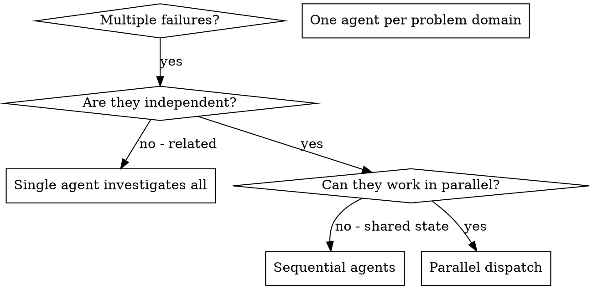

# Dispatching Parallel Agents

## Overview

When you have multiple unrelated failures (different test files, different subsystems, different bugs), investigating them sequentially wastes time. Each investigation is independent and can happen in parallel.

**Core principle:** Dispatch one agent per independent problem domain. Let them work concurrently.

## When to Use



**Use when:**
- 3+ test files failing with different root causes
- Multiple subsystems broken independently
- Each problem can be understood without context from others
- No shared state between investigations

**Don't use when:**
- Failures are related (fix one might fix others)
- Need to understand full system state
- Agents would interfere with each other

## The Pattern

### 1. Identify Independent Domains

Group failures by what's broken:
- File A tests: Tool approval flow
- File B tests: Batch completion behavior
- File C tests: Abort functionality

Each domain is independent - fixing tool approval doesn't affect abort tests.

### 2. Create Focused Agent Tasks

Each agent gets:
- **Specific scope:** One test file or subsystem
- **Clear goal:** Make these tests pass
- **Constraints:** Don't change other code
- **Expected output:** Summary of what you found and fixed

### 3. Dispatch in Parallel

```typescript
// In Claude Code / AI environment
Task("Fix agent-tool-abort.test.ts failures")
Task("Fix batch-completion-behavior.test.ts failures")
Task("Fix tool-approval-race-conditions.test.ts failures")
// All three run concurrently
```

### 4. Review and Integrate

When agents return:
- Read each summary
- Verify fixes don't conflict
- Run full test suite
- Integrate all changes

## Agent Prompt Structure

Good agent prompts are:
1. **Focused** - One clear problem domain
2. **Self-contained** - All context needed to understand the problem
3. **Specific about output** - What should the agent return?

```markdown
Fix the 3 failing tests in src/agents/agent-tool-abort.test.ts:

1. "should abort tool with partial output capture" - expects 'interrupted at' in message
2. "should handle mixed completed and aborted tools" - fast tool aborted instead of completed
3. "should properly track pendingToolCount" - expects 3 results but gets 0

These are timing/race condition issues. Your task:

1. Read the test file and understand what each test verifies
2. Identify root cause - timing issues or actual bugs?
3. Fix by:
   - Replacing arbitrary timeouts with event-based waiting
   - Fixing bugs in abort implementation if found
   - Adjusting test expectations if testing changed behavior

Do NOT just increase timeouts - find the real issue.

Return: Summary of what you found and what you fixed.
```

## Common Mistakes

**❌ Too broad:** "Fix all the tests" - agent gets lost
**✅ Specific:** "Fix agent-tool-abort.test.ts" - focused scope

**❌ No context:** "Fix the race condition" - agent doesn't know where
**✅ Context:** Paste the error messages and test names

**❌ No constraints:** Agent might refactor everything
**✅ Constraints:** "Do NOT change production code" or "Fix tests only"

**❌ Vague output:** "Fix it" - you don't know what changed
**✅ Specific:** "Return summary of root cause and changes"

## When NOT to Use

**Related failures:** Fixing one might fix others - investigate together first
**Need full context:** Understanding requires seeing entire system
**Exploratory debugging:** You don't know what's broken yet
**Shared state:** Agents would interfere (editing same files, using same resources)

## Real Example from Session

**Scenario:** 6 test failures across 3 files after major refactoring

**Failures:**
- agent-tool-abort.test.ts: 3 failures (timing issues)
- batch-completion-behavior.test.ts: 2 failures (tools not executing)
- tool-approval-race-conditions.test.ts: 1 failure (execution count = 0)

**Decision:** Independent domains - abort logic separate from batch completion separate from race conditions

**Dispatch:**
```
Agent 1 → Fix agent-tool-abort.test.ts
Agent 2 → Fix batch-completion-behavior.test.ts
Agent 3 → Fix tool-approval-race-conditions.test.ts
```

**Results:**
- Agent 1: Replaced timeouts with event-based waiting
- Agent 2: Fixed event structure bug (threadId in wrong place)
- Agent 3: Added wait for async tool execution to complete

**Integration:** All fixes independent, no conflicts, full suite green

**Time saved:** 3 problems solved in parallel vs sequentially

## Key Benefits

1. **Parallelization** - Multiple investigations happen simultaneously
2. **Focus** - Each agent has narrow scope, less context to track
3. **Independence** - Agents don't interfere with each other
4. **Speed** - 3 problems solved in time of 1

## Verification

After agents return:
1. **Review each summary** - Understand what changed
2. **Check for conflicts** - Did agents edit same code?
3. **Run full suite** - Verify all fixes work together
4. **Spot check** - Agents can make systematic errors

---

## MANDATORY: Agent Logging Enforcement

**All dispatched agents MUST log their work.** This is not optional.

### Enforcement via Hook

**You do NOT need to include logging instructions in your prompts.**

The `PreToolUse` hook (`.claude/hooks/pre-task-logging.sh`) automatically injects:
- Agent logging protocol
- Partial completion protocol

This happens for EVERY Task tool invocation. You cannot forget it.

### Post-Dispatch Validation

After all agents return, **before integrating their work**:

```bash
# Validate agent logs exist and are complete
./scripts/validate-agent-logs.sh --expect 3 --strict

# If this fails, agents did not log properly - flag this
```

### What to Do If Logs Missing

If `validate-agent-logs.sh` reports missing logs:

1. **Do NOT accept the agent's work as complete**
2. Note which agent failed to log
3. Either:
   - Re-dispatch with stronger logging instructions, OR
   - Accept work but flag as "unverified execution"
4. Consider adding to session notes: "Agent X did not log - work unverified"

### Why This Matters

- **Debugging**: When something breaks, logs show what agents did
- **Audit trail**: Human reviewers can see agent reasoning
- **Knowledge transfer**: Future sessions learn from past decisions
- **Trust building**: Logs prove agents followed process

## MANDATORY: Agent Type Selection

**You MUST use a defined agent type** from `.claude/agents/`. Do NOT invent agent names.

### Available Agent Types

| Agent Type                 | Use For                                                     |
|----------------------------|-------------------------------------------------------------|
| `code-reviewer`            | Code review, implementation verification                    |
| `code-quality-reviewer`    | Code quality audits, standards enforcement                  |
| `documentation-verifier`   | Verify docs match codebase reality                          |
| `tdd-tall-specialist`      | TDD for TALL stack (**human-operated via `/tdd-multi-component-autoloop`**) |
| `tall-specialist`          | Livewire/Alpine/Tailwind work                               |
| `performance-specialist`   | Performance optimization tasks                              |
| `implementer`              | Execute approved plans with TDD                             |
| `spec-reviewer`            | Review requirements before implementation                   |
| `log-driven-debugger`      | Fix errors from application logs                            |
| `ai-engineer`              | LLM apps, RAG systems, AI agent development                 |
| `prompt-engineer`          | Prompt optimization and AI system design                    |
| `vector-database-engineer` | Vector search, embeddings, index optimization               |
| `Explore`                  | Codebase exploration (built-in)                             |
| `general-purpose`          | Generic tasks (built-in)                                    |

### When Dispatching

```markdown
# CORRECT - uses defined agent type
Task(subagent_type="documentation-verifier", prompt="...")

# WRONG - invents agent name
Task(subagent_type="doc-verifier", prompt="...")  # NOT DEFINED
Task(subagent_type="file-checker", prompt="...")  # NOT DEFINED
```

---

## MANDATORY: Anti-Slacker Requirements

**Agents MUST prove they did the work.** Vague "completed" claims are NOT acceptable.

### Enforcement

Anti-slacker requirements are baked into agent definitions (`.claude/agents/*.md`).
Each agent definition includes explicit evidence requirements for its domain.

### What Slacker Behavior Looks Like

**BAD (slacker):**
```
Verified all 9 documentation files. 8 are accurate, 1 needs update.
```

**GOOD (thorough):**
```
## Verification Report

| File | Claims | Verified | Discrepancies |
|------|--------|----------|---------------|
| API.md | 12 | 12 | 0 |
| SETUP.md | 8 | 7 | 1 |
| ... | ... | ... | ... |

### Discrepancy Details

1. **SETUP.md:45** - Claims `scripts/install.sh` exists
   - Verified: `glob "scripts/install*"` → 0 results
   - Action: File missing, doc needs update
```

---

## Thoroughness Checklist

Before dispatching agents, ensure your prompts include:

- [ ] Explicit agent type from `.claude/agents/`
- [ ] Clear scope (exact files/items to process)
- [ ] Expected output format with per-item detail

**Note:** Logging and partial-completion protocols are automatically injected by hook.

---

## MANDATORY: Iterative Completion Protocol

**Subagents may hit context limits.** This is normal. They should report honestly, not rush to claim "done".

### Enforcement via Hook

The `PreToolUse` hook automatically injects the partial completion protocol:
- Permission to stop early when quality would suffer
- Structured reporting format for partial completions
- Clear message that orchestrator will continue the work

**You do NOT need to include this in your prompts.** It's automatic.

### Orchestrator: Handling Partial Completions

When agents return, check their completion status:

```python
# Pseudocode for orchestrator logic
def handle_agent_results(results):
    completed_items = []
    remaining_items = []

    for result in results:
        if result.completion_status == "complete":
            completed_items.extend(result.items_completed)
        elif result.completion_status == "partial":
            completed_items.extend(result.items_completed)
            remaining_items.extend(result.items_remaining)

    if remaining_items:
        report_to_user(f"""
        Progress: {len(completed_items)}/{len(completed_items) + len(remaining_items)} items complete

        Remaining: {remaining_items}

        Say "continue" to dispatch agents for remaining items.
        """)
```

### Orchestrator Reporting Format

Report to user:

```markdown
## Agent Dispatch Results

| Batch | Agent Type | Assigned | Completed | Status |
|-------|------------|----------|-----------|--------|
| 1 | documentation-verifier | 9 | 9 | ✅ complete |
| 2 | documentation-verifier | 9 | 3 | ⏳ partial |
| 3 | documentation-verifier | 9 | 7 | ⏳ partial |

**Overall Progress:** 19/27 items (70%)

**Remaining Items:**
- file4.md, file5.md, ... (Batch 2)
- file8.md, file9.md (Batch 3)

To continue processing remaining items, say **"continue"**.
```

### Continuation Protocol

When user says "continue":

1. Collect all remaining items from partial completions
2. Re-batch remaining items (don't overload new agents)
3. Dispatch new agents with same protocol
4. Repeat until all items complete

### Why This Works

- **Removes completion pressure** - Agents know partial is OK
- **Maintains quality** - Agents stop before quality suffers
- **Enables iteration** - Orchestrator can continue the work
- **Provides visibility** - User sees true progress
- **Honest reporting** - No more "verified all 9 files" lies

---

## Real-World Impact

From debugging session (2025-10-03):
- 6 failures across 3 files
- 3 agents dispatched in parallel
- All investigations completed concurrently
- All fixes integrated successfully
- Zero conflicts between agent changes
