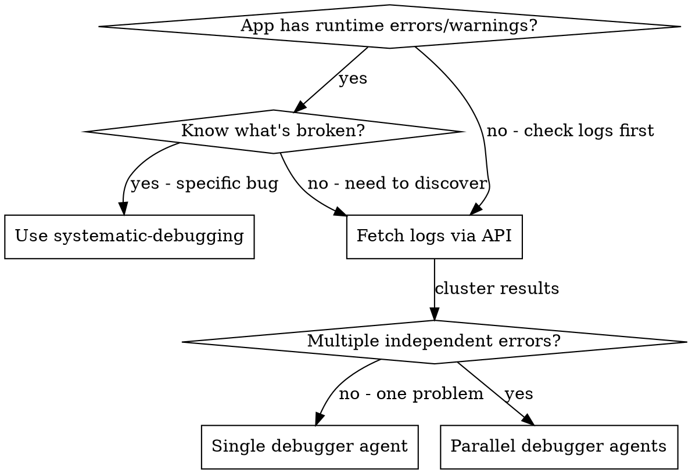

# Log-Driven Debugging

## Overview

Fetch errors from the application log via the Log File API, cluster them by root cause, and dispatch parallel `log-driven-debugger` subagents to fix each independent problem domain.

**Core principle:** Logs tell you what's broken. Clustering tells you how many problems exist. Parallel agents fix them all at once.

## When to Use



**Use when:**
- Application is throwing errors and you want agents to self-heal
- Starting a new session and want to check application health
- After deployment to verify no new errors
- Periodic health sweep

**Don't use when:**
- You already know the specific bug (use `systematic-debugging` directly)
- Errors are from external services you can't fix (just document)
- Log file is empty or unavailable

## The Process

### Step 1: Fetch Log Entries

Use the Log File API to get recent errors and warnings:

```bash
# Get recent errors (default: laravel.log, last 100 entries)
curl -H "Authorization: Bearer $TOKEN" "$HOST/api/logs/entries?level=ERROR&lines=200"

# Get errors and warnings together
curl -H "Authorization: Bearer $TOKEN" "$HOST/api/logs/entries?level=ERROR,WARNING&lines=200"

# Check a specific log file
curl -H "Authorization: Bearer $TOKEN" "$HOST/api/logs/entries?level=ERROR&file=laravel-2026-01-31.log"

# List available log files first
curl -H "Authorization: Bearer $TOKEN" "$HOST/api/logs/files"
```

**For orchestrator (in-session):** Use `Bash` tool with `curl` or read the log directly:

```bash
# Direct file read (faster, no auth needed in dev)
tail -n 5000 storage/logs/laravel.log | grep -E '\.(ERROR|WARNING):' | tail -200
```

### Step 2: Cluster Errors by Root Cause

Group log entries into independent problem domains. Entries belong to the same cluster if:

- Same exception class and file:line
- Same error message pattern (ignoring timestamps, IDs, signatures)
- Same subsystem (e.g., all Pusher errors, all database errors)

**Example clustering from real logs:**

| Cluster | Pattern | Count | Priority |
|---------|---------|-------|----------|
| A | Pusher cURL connection failed (port 8080) | 15 | medium - infra/config |
| B | Undefined table: case_documents | 2 | high - missing migration |
| C | Maximum execution time exceeded (Guzzle) | 1 | medium - timeout/perf |
| D | Circuit breaker failure (OpenAI 401) | 3 | high - auth config |
| E | EpredmetWidget render failed (null childNodes) | 5 | medium - code bug |

### Step 3: Triage and Prioritize

Not all errors need agent dispatch:

| Decision | Action |
|----------|--------|
| Code bug (logic error, null ref, missing check) | Dispatch debugger agent |
| Missing migration/table | Dispatch debugger agent |
| Config issue (.env, service URL) | Fix directly or note for human |
| External service down | Document, skip (can't fix) |
| Duplicate/related to another cluster | Merge clusters |
| Honeypot/security scan noise | Ignore |

### Step 4: Dispatch Parallel Debugger Agents

**REQUIRED:** Use `superpowers:dispatching-parallel-agents` methodology.

For each independent fixable cluster, dispatch a `log-driven-debugger` agent:

```
Task(subagent_type="general-purpose", prompt="""
You are a log-driven-debugger agent. Read .claude/agents/log-driven-debugger.md for your full protocol.

## Error Cluster
[Paste the actual log entries for this cluster]

## Error Summary
[e.g., "EpredmetWidget render fails with null childNodes on dashboard"]

## Priority
[high]

## Constraints
[e.g., "Do not modify the EpredmetWidget base class, only the render method"]
""")
```

**Parallelism rules (from dispatching-parallel-agents):**
- One agent per independent cluster
- Max 3-4 parallel agents (avoid file conflicts)
- If two clusters might touch the same files, run them sequentially
- Each agent commits independently

### Step 5: Review and Integrate

When agents return:

1. **Read each report** - Understand root cause and fix
2. **Check for conflicts** - Did agents modify same files?
3. **Run full test suite** - `./scripts/run-tests-with-analysis.sh`
4. **Validate agent logs** - `./scripts/validate-agent-logs.sh --expect N`
5. **Merge/commit** if all tests pass

## Quick Reference

| API Endpoint | Purpose |
|-------------|---------|
| `GET /api/logs/files` | List available log files |
| `GET /api/logs/entries?level=ERROR` | Get ERROR entries |
| `GET /api/logs/entries?level=ERROR,WARNING&lines=200` | Get errors + warnings |
| `GET /api/logs/entries?file=laravel-2026-01-31.log` | Specific log file |

| Cluster Decision | Action |
|-----------------|--------|
| Independent code bug | Dispatch `log-driven-debugger` agent |
| Related to another cluster | Merge, single agent |
| Config/infra issue | Fix directly or flag for human |
| External service | Document, skip |
| Security noise | Ignore |

## Common Mistakes

| Mistake | Fix |
|---------|-----|
| Dispatching agent for external service outage | Check if error is fixable in code first |
| One agent per log line instead of per cluster | Cluster by root cause pattern first |
| Parallel agents editing same file | Check file overlap, run sequentially if needed |
| Skipping triage, dispatching for everything | Triage saves wasted agent cycles |
| Not running full test suite after fixes | Always verify no regressions |
| Ignoring WARNING level | Warnings often precede errors, include them |

## Integration

**Required skills:**
- **dispatching-parallel-agents** - REQUIRED: Governs how to dispatch and verify parallel agents
- **systematic-debugging** - REQUIRED BACKGROUND: Each debugger agent uses this internally

**Required agent:**
- `.claude/agents/log-driven-debugger.md` - REQUIRED: Agent spec for each dispatched debugger

**Complementary skills:**
- **verification-before-completion** - Verify all fixes before claiming done
- **test-driven-development** - Each debugger agent uses TDD for fixes
