# AI Legal War Machine - System Architecture

**Version**: 1.0
**Date**: 2025-11-11
**Status**: Production

## Table of Contents

1. [System Overview](#system-overview)
2. [High-Level Architecture](#high-level-architecture)
3. [Agent Architecture](#agent-architecture)
4. [Multi-Agent Orchestration](#multi-agent-orchestration)
5. [Data Flow](#data-flow)
6. [Module Architecture](#module-architecture)
7. [Integration Architecture](#integration-architecture)
8. [Deployment Architecture](#deployment-architecture)

---

## System Overview

AI Legal War Machine is a comprehensive suite of AI-powered legal defense tools for Croatian criminal defense attorneys, combining:

- **Vector Search**: Semantic search across laws and court decisions
- **Graph Database (Neo4j)**: Citation networks and legal relationships
- **AI Agents**: Autonomous specialist agents for research, analysis, and strategy
- **AWS Textract**: OCR for PDF document processing
- **Multi-Agent Orchestration**: Coordinated AI agents working together

**Tech Stack**:
- Laravel 11 + PHP 8.2+
- PostgreSQL (primary data + pgvector for embeddings)
- Neo4j (graph relationships)
- OpenAI GPT-4o / GPT-4o-mini
- AWS S3 + Textract
- Redis (caching + queues)

---

## High-Level Architecture

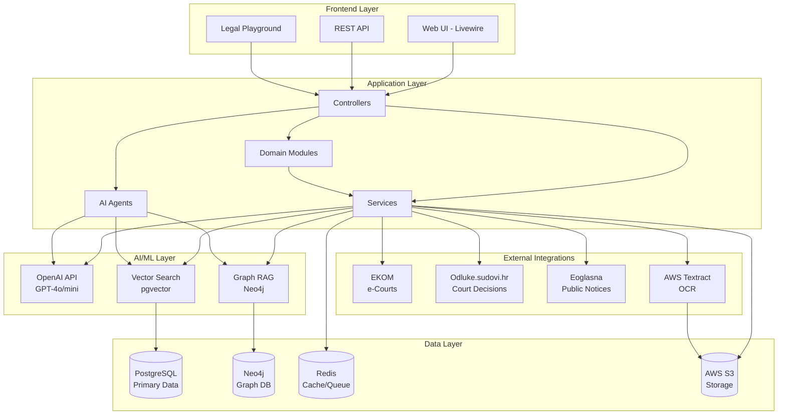

**Key Components**:
- **Frontend**: Livewire components + REST API
- **Application**: Controllers, Services, AI Agents, Domain Modules
- **AI/ML**: OpenAI integration, Vector search, Graph RAG
- **Data**: PostgreSQL (primary + vectors), Neo4j (graph), Redis (cache/queue), S3 (files)
- **External**: EKOM (e-courts), Odluke (decisions), Eoglasna (notices), Textract (OCR)

---

## Agent Architecture

### Agent System Overview

```mermaid
graph TB
    subgraph "Agent Types"
        Research[ResearchSpecialistAgent<br/>Legal Research]
        Precedent[PrecedentAnalystAgent<br/>Case Analysis]
        Risk[RiskAnalystAgent<br/>Risk Assessment]
        Strategy[StrategySpecialistAgent<br/>Strategy Development]
        Decision[DecisionDiscoveryAgent<br/>Decision Discovery]
        Odluke[OdlukeAgent<br/>MCP Integration]
    end

    subgraph "Agent Infrastructure"
        Context[SharedAgentContext<br/>Shared Memory]
        CommBus[AgentCommunicationBus<br/>Messaging]
        Trace[ReasoningTraceService<br/>Explainability]
        Cache[AgentResultCache<br/>Performance]
        Parallel[ParallelExecution<br/>Concurrency]
    end

    subgraph "Agent Tools"
        LawSearch[LawSearchService]
        DecisionSearch[DecisionSearchService]
        GraphEnhancer[GraphResearchEnhancer]
        OpenAI[OpenAIService]
    end

    subgraph "Data Storage"
        AgentRuns[(agent_runs)]
        AgentComms[(agent_communications)]
        Traces[(reasoning_traces)]
        Learning[(learning_opportunities)]
    end

    Research --> Context
    Precedent --> Context
    Risk --> Context
    Strategy --> Context
    Decision --> Context
    Odluke --> Context

    Research --> CommBus
    Precedent --> CommBus
    Risk --> CommBus
    Strategy --> CommBus

    Research --> Trace
    Precedent --> Trace
    Risk --> Trace
    Strategy --> Trace

    Research --> Cache
    Precedent --> Cache

    Research --> Parallel

    Research --> LawSearch
    Research --> DecisionSearch
    Research --> GraphEnhancer

    Precedent --> OpenAI
    Risk --> OpenAI
    Strategy --> OpenAI

    Context --> AgentRuns
    CommBus --> AgentComms
    Trace --> Traces
    Research --> Learning
    Precedent --> Learning
```

### Agent Capabilities

| Agent | Role | Primary Function | Key Tools |
|-------|------|------------------|-----------|
| **ResearchSpecialist** | Legal Researcher | Find relevant laws and court decisions | LawSearch, DecisionSearch, GraphRAG |
| **PrecedentAnalyst** | Case Analyst | Analyze applicability and authority of precedents | OpenAI, ActiveLearning |
| **RiskAnalyst** | Risk Assessor | Identify risks and vulnerabilities | OpenAI, Pattern Analysis |
| **StrategySpecialist** | Strategist | Develop legal strategies and action plans | OpenAI, Success Prediction |
| **DecisionDiscoveryAgent** | Discovery | Discover and analyze court decisions | Odluke API, OpenAI |
| **OdlukeAgent** | MCP Integration | MCP-powered search and analysis | MCP Tools, Odluke API |

### Agent Lifecycle

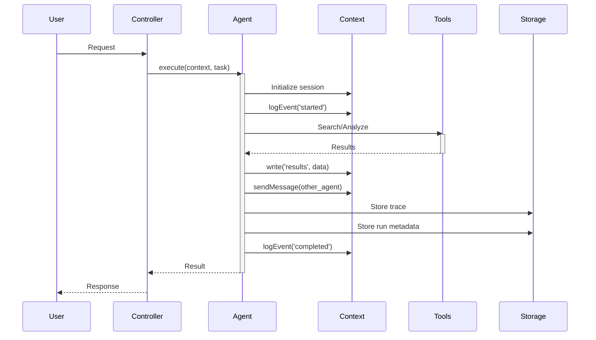

---

## Multi-Agent Orchestration

### Orchestration Flow

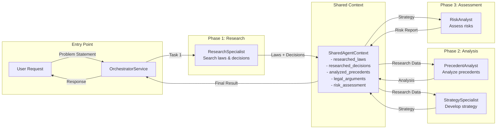

### Communication Patterns

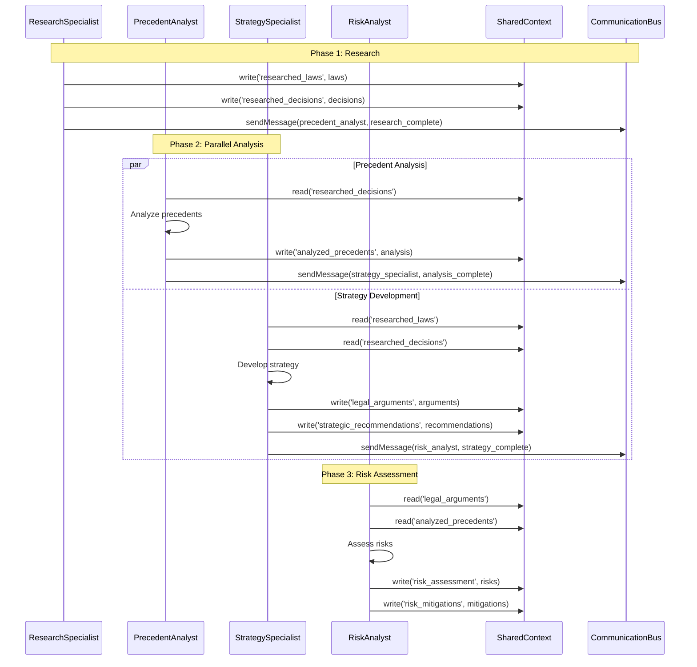

### Orchestration Configuration

```php
// config/agent.php
'orchestration' => [
    'enabled' => env('AGENT_ORCHESTRATION_ENABLED', true),
    'max_parallel_agents' => 3,
    'timeout_seconds' => 300,
    'retry_failed_agents' => true,
    'max_retries' => 2,
],
```

---

## Data Flow

### Research to Strategy Flow

```mermaid
graph TD
    subgraph "Input"
        Problem[Problem Statement<br/>"Client charged with..."]
    end

    subgraph "Research Phase"
        LawSearch[Law Vector Search<br/>pgvector]
        DecisionSearch[Decision Vector Search<br/>pgvector]
        GraphSearch[Graph Traversal<br/>Neo4j]
    end

    subgraph "Enrichment"
        Dedupe[Deduplicate Results]
        Prioritize[Prioritize by Authority]
        GraphMerge[Merge Graph Results]
    end

    subgraph "Analysis Phase"
        ScorePrecedents[Score Applicability<br/>0-100]
        ClassifyAuthority[Classify Authority<br/>binding/persuasive]
        IdentifyFactors[Identify Key Factors]
    end

    subgraph "Strategy Phase"
        DevelopArgs[Develop Arguments]
        EstimateSuccess[Estimate Success Prob]
        CreatePlan[Create Action Plan]
    end

    subgraph "Risk Phase"
        AnalyzeWeaknesses[Analyze Weaknesses]
        IdentifyAdverse[Identify Adverse Precedents]
        GenerateMitigations[Generate Mitigations]
    end

    subgraph "Output"
        Report[Comprehensive Legal Analysis]
    end

    Problem --> LawSearch
    Problem --> DecisionSearch
    Problem --> GraphSearch

    LawSearch --> Dedupe
    DecisionSearch --> Dedupe
    GraphSearch --> GraphMerge

    GraphMerge --> Dedupe
    Dedupe --> Prioritize

    Prioritize --> ScorePrecedents
    ScorePrecedents --> ClassifyAuthority
    ClassifyAuthority --> IdentifyFactors

    IdentifyFactors --> DevelopArgs
    DevelopArgs --> EstimateSuccess
    EstimateSuccess --> CreatePlan

    CreatePlan --> AnalyzeWeaknesses
    AnalyzeWeaknesses --> IdentifyAdverse
    IdentifyAdverse --> GenerateMitigations

    GenerateMitigations --> Report
```

### Vector + Graph Hybrid Search

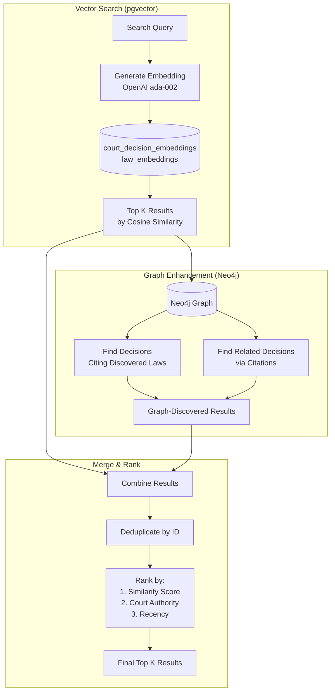

---

## Module Architecture

### Module Structure

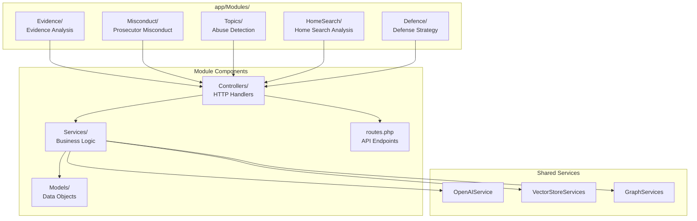

### Evidence Module Example

```
app/Modules/Evidence/
├── Controllers/
│   └── EvidenceAnalysisController.php
├── Services/
│   ├── EvidenceAnalysisService.php
│   └── RecontextualizationService.php
├── Models/
│   └── EvidenceAnalysis.php
└── routes.php  (API endpoints)

API Endpoints:
POST /api/evidence/analyze
POST /api/evidence/recontextualize
POST /api/evidence/suppression-motion
```

---

## Integration Architecture

### External Integrations

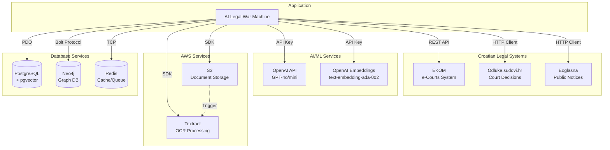

### MCP (Model Context Protocol) Integration

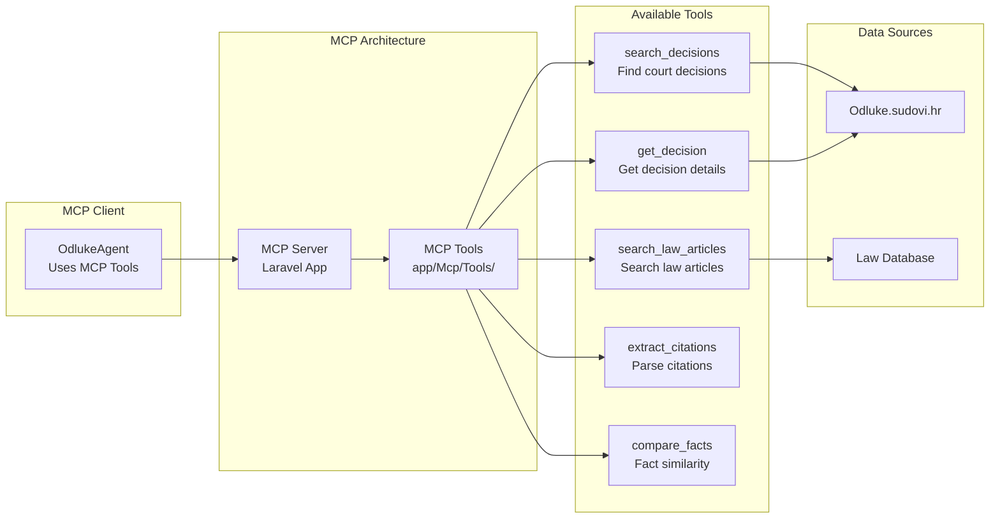

---

## Deployment Architecture

### Production Deployment

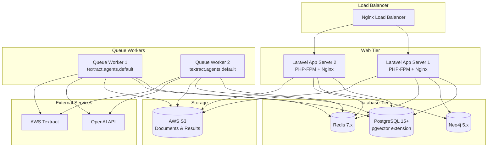

### Scaling Strategy

| Component | Scaling Strategy | Notes |
|-----------|-----------------|-------|
| **Web Tier** | Horizontal (Add servers) | Stateless, sessions in Redis |
| **Queue Workers** | Horizontal (Add workers) | Independent queue processing |
| **PostgreSQL** | Vertical + Read Replicas | Primary for writes, replicas for reads |
| **Neo4j** | Cluster (Enterprise) | Causal clustering for HA |
| **Redis** | Cluster + Sentinel | High availability + partitioning |
| **S3** | Auto-scaling | Managed by AWS |

---

## Security Architecture

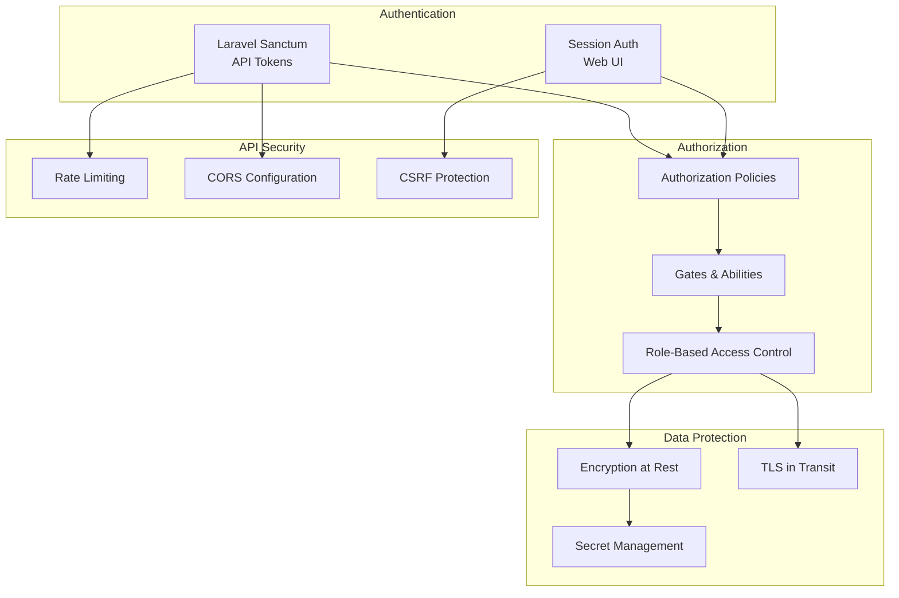

---

## Performance Architecture

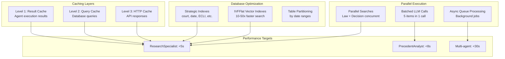

**Performance Optimizations**:
1. **Database Indexes**: 50-70% query improvement
2. **Vector Indexes (IVFFlat)**: 10-50x similarity search improvement
3. **Result Caching**: Eliminates redundant agent executions
4. **Parallel Execution**: 30-50% time reduction for independent operations
5. **LLM Batching**: 70% faster, 80% cost reduction

---

## Monitoring & Observability

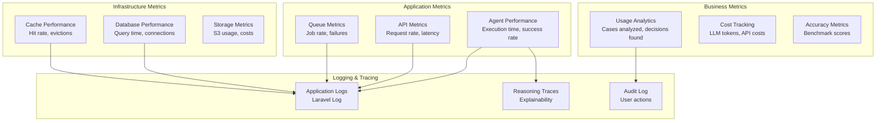

---

## Technology Stack

### Backend

| Component | Technology | Version | Purpose |
|-----------|-----------|---------|---------|
| **Framework** | Laravel | 11.x | Web application framework |
| **Language** | PHP | 8.2+ | Server-side programming |
| **Database** | PostgreSQL | 15+ | Primary data store |
| **Vector DB** | pgvector | 0.5+ | Vector embeddings |
| **Graph DB** | Neo4j | 5.x | Citation relationships |
| **Cache/Queue** | Redis | 7.x | Caching & job queues |
| **Storage** | AWS S3 | - | Document storage |
| **OCR** | AWS Textract | - | PDF text extraction |

### AI/ML

| Component | Technology | Purpose |
|-----------|-----------|---------|
| **LLM** | OpenAI GPT-4o / GPT-4o-mini | Text generation & analysis |
| **Embeddings** | text-embedding-ada-002 | Vector embeddings |
| **Vector Search** | pgvector (IVFFlat) | Similarity search |
| **Graph RAG** | Neo4j Cypher | Graph traversal |

### Frontend

| Component | Technology | Purpose |
|-----------|-----------|---------|
| **UI Framework** | Livewire | Reactive components |
| **CSS Framework** | Tailwind CSS | Styling |
| **Build Tool** | Vite | Asset bundling |

---

## File Structure

```
ai-legal-war-machine/
├── app/
│   ├── Agents/              # AI Agents
│   │   ├── Specialists/     # Specialist agents
│   │   └── ...
│   ├── Modules/             # Domain modules
│   │   ├── Evidence/
│   │   ├── Misconduct/
│   │   └── Topics/
│   ├── Services/            # Business logic
│   │   ├── Collaboration/   # Agent collaboration
│   │   ├── Graph/           # Neo4j services
│   │   └── ...
│   ├── Mcp/                 # MCP server & tools
│   ├── Benchmarks/          # Performance benchmarks
│   └── Console/Commands/    # Artisan commands
├── database/
│   ├── migrations/          # Database migrations
│   └── factories/           # Test data factories
├── tests/
│   ├── Feature/             # Feature tests
│   ├── Unit/                # Unit tests
│   └── Fixtures/            # Test fixtures
├── docs/                    # Documentation
│   ├── ARCHITECTURE.md      # This file
│   ├── BENCHMARKS.md
│   ├── PERFORMANCE_OPTIMIZATION.md
│   └── VALIDATION_RESULTS.md
├── config/                  # Configuration files
└── routes/                  # Route definitions
```

---

## Design Patterns

### Agent Pattern

**Pattern**: Autonomous AI agents with specialized roles

**Implementation**:
- Each agent is a self-contained class
- Agents communicate via `SharedAgentContext`
- Agents use `ReasoningTraceService` for explainability
- Agents can send messages via `AgentCommunicationBus`

### Repository Pattern

**Pattern**: Abstraction layer for data access

**Implementation**:
- Services encapsulate business logic
- Models represent data objects
- No direct DB queries in controllers

### Circuit Breaker Pattern

**Pattern**: Prevent cascading failures from external services

**Implementation**:
- `OdlukeClient` implements circuit breaker
- After 3 failures, circuit opens (stops calls)
- Automatic retry after timeout

### Cache-Aside Pattern

**Pattern**: Application manages cache explicitly

**Implementation**:
- `AgentResultCacheService` implements cache-aside
- Try cache first, execute on miss, store result
- TTL-based expiration

---

## References

- [API Documentation](API_DOCUMENTATION.md)
- [Performance Optimization Guide](PERFORMANCE_OPTIMIZATION.md)
- [Benchmark Documentation](BENCHMARKS.md)
- [Testing Guide](TESTING.md)
- [CLAUDE.md](../CLAUDE.md) - Quick reference

---

**Last Updated**: 2025-11-11
**Maintained By**: Development Team
**Version**: 1.0
