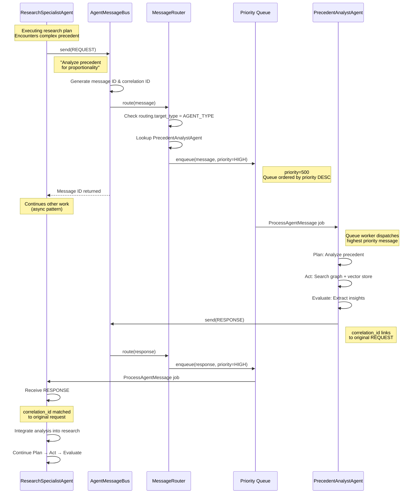
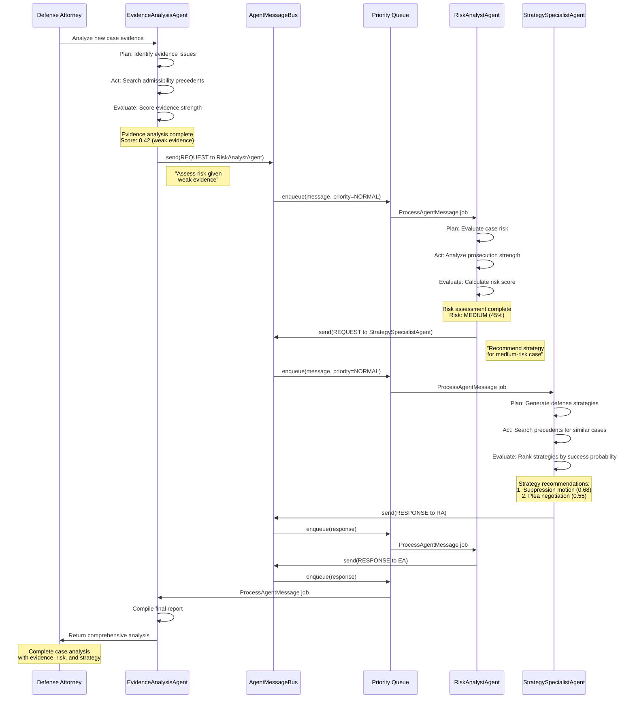
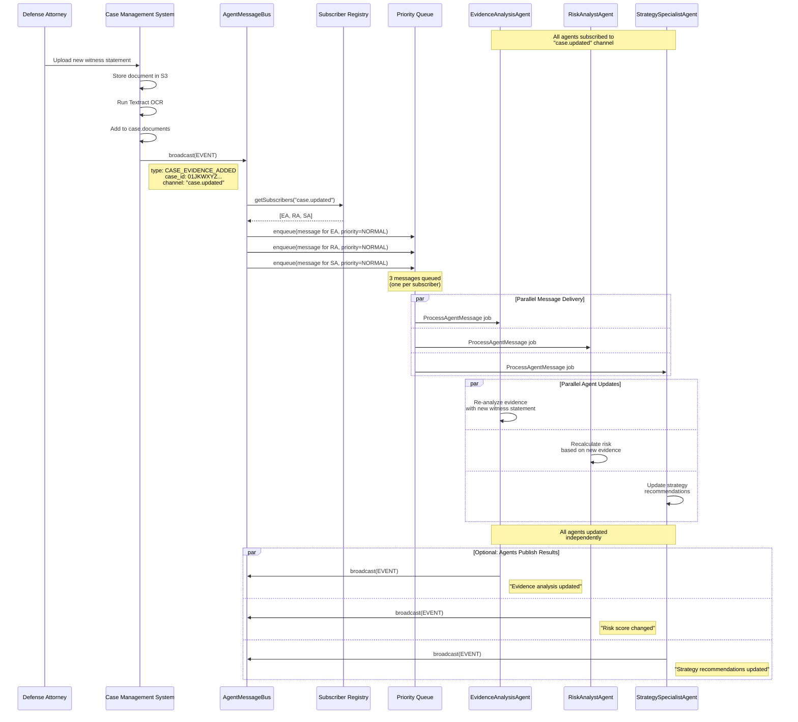
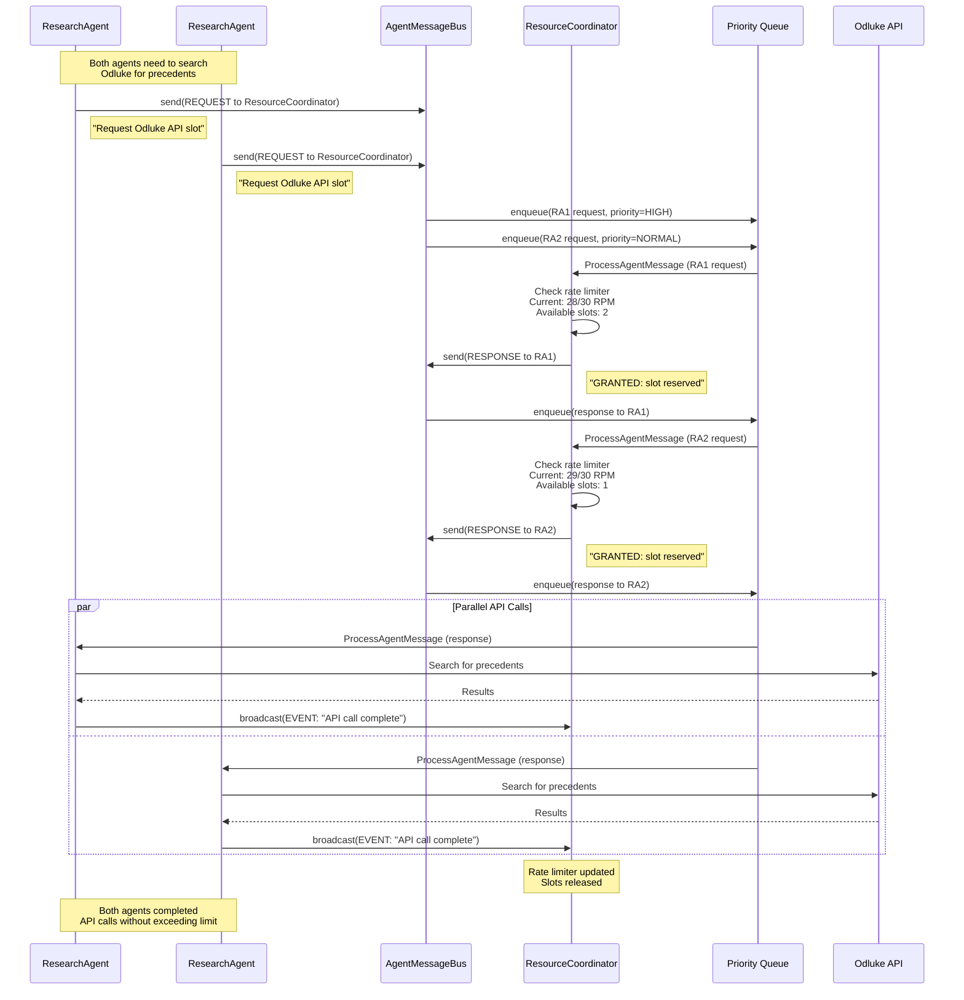

# Agent Communication Bus - Sequence Diagrams

This document illustrates common communication patterns in the Agent Communication Bus architecture.

## Scenario 1: Collaborative Research (Request/Response)

**Use Case**: A Research Specialist agent encounters a complex precedent case and requests help from a Precedent Analyst specialist.



**Key Points**:
- Asynchronous request/response pattern
- Correlation ID links response back to request
- Both agents continue work while waiting
- Priority ensures timely processing

---

## Scenario 2: Pipeline Processing (Sequential Work Passing)

**Use Case**: A case is processed through multiple agent stages: Evidence Analysis → Risk Assessment → Strategy Recommendation



**Key Points**:
- Sequential pipeline: EA → RA → SA → (back through chain)
- Each agent completes its work before triggering next stage
- Responses flow back through the chain
- Eventual consistency: Total time 10-30 seconds

---

## Scenario 3: Broadcast Coordination (Event Notification)

**Use Case**: New evidence is added to a case. All agents working on that case need to be notified to update their analysis.



**Key Points**:
- Single broadcast reaches multiple subscribers
- Subscriber Registry maintains channel subscriptions
- Agents process event independently (parallel execution)
- No response expected (fire-and-forget pattern)
- Agents can publish their own events after updating

---

## Scenario 4: Resource Negotiation (Coordination)

**Use Case**: Multiple agents want to call the Odluke.sudovi.hr API, but must respect rate limits (30 requests/minute). Agents coordinate to avoid exceeding the limit.



**Key Points**:
- ResourceCoordinator acts as gatekeeper for rate-limited resources
- Priority queue ensures urgent requests processed first
- Agents wait for GRANTED response before calling API
- Broadcast events signal slot release (for next waiting agent)
- Prevents circuit breaker trips from rate limit violations

---

## Message Flow Performance Characteristics

### Latency Targets

| Priority   | Target Delivery Time | Max Queue Depth | Use Cases                          |
|------------|----------------------|------------------|------------------------------------|
| CRITICAL   | < 1 second           | 10 messages      | Court deadlines, emergencies       |
| HIGH       | < 3 seconds          | 50 messages      | Active case work, user requests    |
| NORMAL     | < 5 seconds          | 200 messages     | Background research, analysis      |
| LOW        | < 30 seconds         | 1000 messages    | Corpus updates, batch processing   |

### Throughput Targets

- **Current Scale**: 100+ messages/minute
- **Target Scale**: 500 messages/minute (5x headroom)
- **Peak Scale**: 1000 messages/minute (circuit breaker threshold)

### Reliability Guarantees

- **At-Least-Once Delivery**: Messages remain in queue until acknowledged
- **Persistence**: All messages logged to `agent_messages` table
- **TTL Handling**: Messages expire after `ttl_seconds` (default: 3600)
- **Dead Letter Queue**: Failed messages after 3 retries moved to DLQ

---

## Queue Worker Configuration

### Recommended Worker Setup

```bash
# Production: Multiple workers for priority tiers
php artisan queue:work --queue=agent_messages_critical --tries=3 --timeout=60
php artisan queue:work --queue=agent_messages_high --tries=3 --timeout=120
php artisan queue:work --queue=agent_messages_normal --tries=3 --timeout=300
php artisan queue:work --queue=agent_messages_low --tries=1 --timeout=600

# Development: Single worker for all priorities
php artisan queue:work --queue=agent_messages --tries=3 --timeout=300
```

### Monitoring Commands

```bash
# Check queue depth by priority
php artisan queue:monitor agent_messages_critical --max=10
php artisan queue:monitor agent_messages_high --max=50

# Retry failed messages
php artisan queue:retry all

# Clear stuck messages
php artisan queue:flush
```

---

## Testing Examples

### Unit Test: Request/Response Flow

```php
use App\Services\AgentBus\AgentMessageBus;
use App\Services\AgentBus\AgentMessage;
use Tests\TestCase;

class AgentCommunicationTest extends TestCase
{
    public function test_request_response_correlation()
    {
        $bus = app(AgentMessageBus::class);

        // Agent 1 sends request
        $request = new AgentMessage([
            'type' => 'REQUEST',
            'routing' => ['target_type' => 'AGENT', 'target_id' => 'agent-2'],
            'payload' => ['action' => 'ANALYZE_PRECEDENT'],
        ]);

        $messageId = $bus->send($request);

        // Assert message queued
        $this->assertDatabaseHas('jobs', [
            'queue' => 'agent_messages_high',
        ]);

        // Agent 2 sends response
        $response = new AgentMessage([
            'type' => 'RESPONSE',
            'correlation_id' => $messageId,
            'routing' => ['target_type' => 'AGENT', 'target_id' => 'agent-1'],
            'payload' => ['status' => 'SUCCESS', 'result' => ['confidence' => 0.87]],
        ]);

        $bus->send($response);

        // Assert correlation preserved
        $this->assertEquals($messageId, $response->correlation_id);
    }
}
```

### Integration Test: Broadcast to Multiple Agents

```php
public function test_broadcast_delivers_to_all_subscribers()
{
    $bus = app(AgentMessageBus::class);
    $registry = app(SubscriberRegistry::class);

    // Subscribe 3 agents to channel
    $registry->subscribe('case.updated', 'agent-1');
    $registry->subscribe('case.updated', 'agent-2');
    $registry->subscribe('case.updated', 'agent-3');

    // Broadcast event
    $broadcast = new AgentMessage([
        'type' => 'BROADCAST',
        'routing' => ['target_type' => 'BROADCAST', 'channel' => 'case.updated'],
        'payload' => ['event' => 'EVIDENCE_ADDED'],
    ]);

    $bus->broadcast($broadcast);

    // Assert 3 messages queued (one per subscriber)
    $this->assertEquals(3, DB::table('jobs')->where('queue', 'agent_messages_normal')->count());
}
```

---

## Next Steps

1. **Team Review**: Review sequence diagrams with development team
2. **Performance Testing**: Validate latency targets with load tests
3. **Implementation**: Begin Phase 2 (Core Infrastructure) - see ADR-001
4. **Documentation**: Update AGENTS.md with communication bus usage examples

---

**Related Documents**:
- [ADR-001: Agent Communication Bus](./adr-001-agent-communication-bus.md)
- [AGENTS.md](../AGENTS.md)
- Sprint 17.6 Requirements
