# Legal Reasoning System - Architecture & Flow Documentation

## Table of Contents
1. [System Overview](#system-overview)
2. [Database Schema](#database-schema)
3. [Service Architecture](#service-architecture)
4. [Data Flow](#data-flow)
5. [API Flow](#api-flow)
6. [Component Interactions](#component-interactions)
7. [Implementation Status](#implementation-status)

---

## System Overview

The Legal Reasoning System provides AI-powered legal analytics, predictive capabilities, and strategic planning for legal cases. It consists of three main subsystems:

1. **Legal Reasoning Engine** - Conflict resolution, citation analysis, legal logic
2. **Predictive Analytics** - Outcome prediction, duration estimation, impact analysis
3. **Legal Strategy Builder** - Argument generation, risk assessment, action planning

### Technology Stack
- **Framework**: Laravel 12.0
- **Database**: PostgreSQL with pgvector extension
- **Graph DB**: Neo4j (for citation networks)
- **AI/ML**: OpenAI GPT-4o-mini, text-embedding-3-small
- **Vector Search**: pgvector (1536 dimensions)

---

## Database Schema

### Core Tables

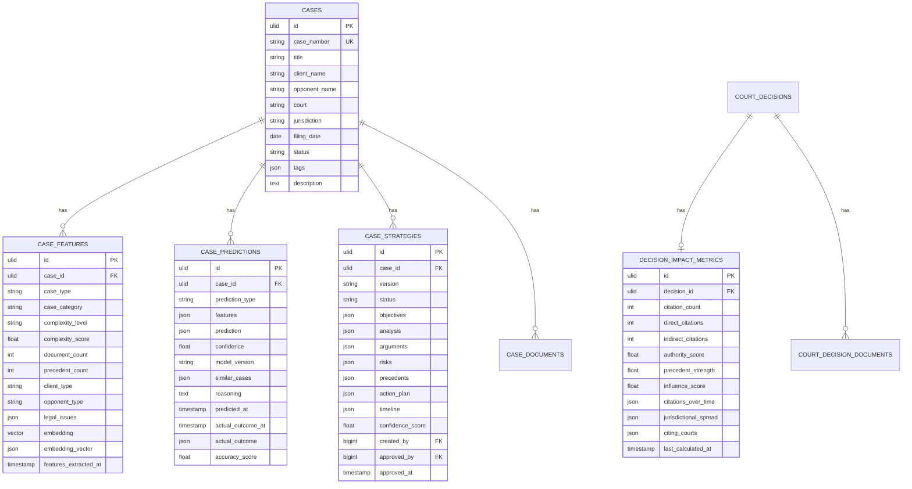

### Indexes & Performance

**case_features:**
- `(case_type, case_category)` - Fast filtering by type
- `complexity_score` - Range queries
- `case_id` UNIQUE - One feature set per case
- Vector index on `embedding` (IVFFlat for pgvector)

**case_predictions:**
- `(case_id, prediction_type)` - Multi-column lookup
- `predicted_at` - Temporal queries

**decision_impact_metrics:**
- `authority_score`, `precedent_strength`, `citation_count` - Ranking queries

---

## Service Architecture

### Dependency Graph

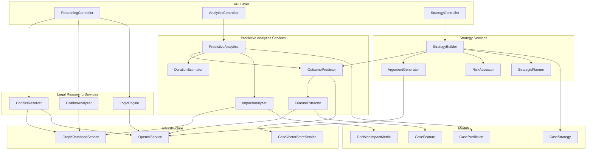

### Service Registrations

All services registered as singletons in `LegalReasoningServiceProvider`:

```php
// Foundation Services
FeatureExtractor(OpenAIService)
OutcomePredictor(OpenAIService, CaseVectorStoreService, FeatureExtractor)

// Reasoning Services
ConflictResolver(GraphDatabaseService, OpenAIService)
CitationAnalyzer(GraphDatabaseService)
LogicEngine(OpenAIService)

// Analytics Services
DurationEstimator()
ImpactAnalyzer(GraphDatabaseService)
PredictiveAnalytics(OutcomePredictor, DurationEstimator, ImpactAnalyzer)

// Strategy Services
ArgumentGenerator(OpenAIService)
RiskAssessor(ConflictResolver)
StrategicPlanner(DurationEstimator)
StrategyBuilder(OutcomePredictor, ArgumentGenerator, RiskAssessor, OpenAIService)
```

---

## Data Flow

### 1. Feature Extraction & Persistence Flow

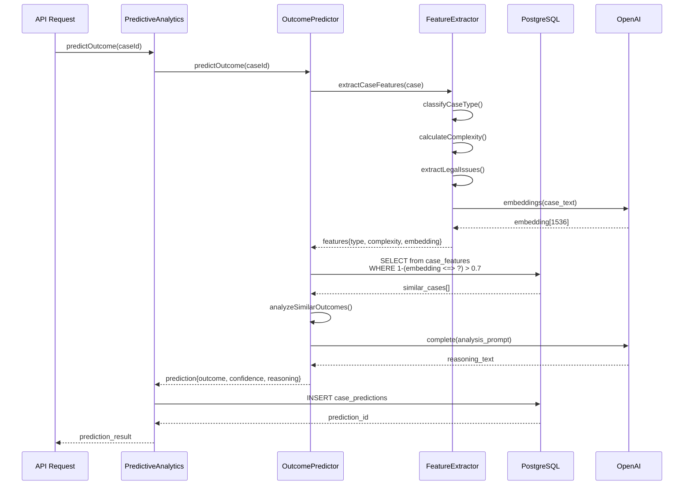

### 2. Feature Persistence Flow

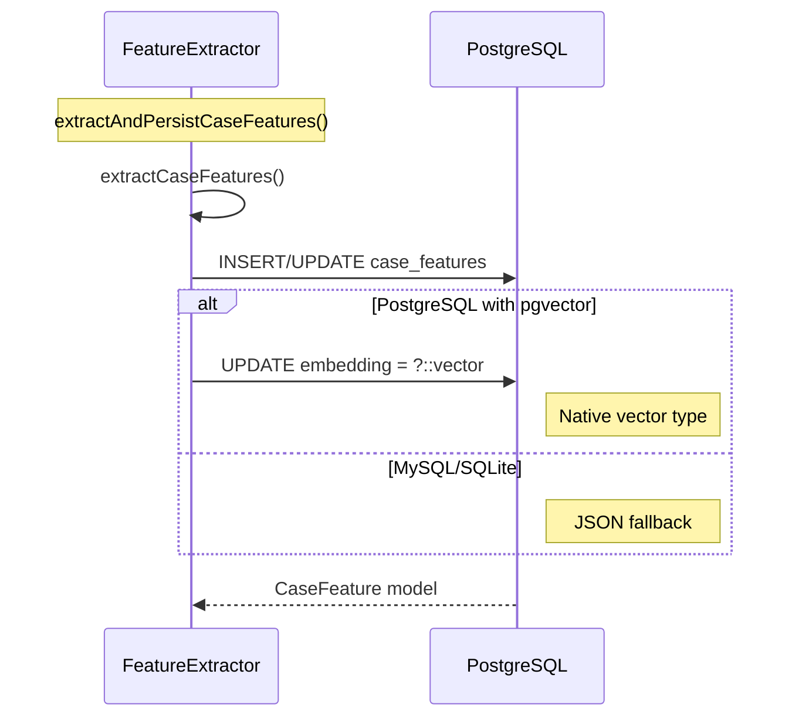

### 3. Outcome Prediction Flow

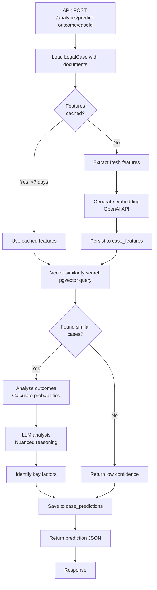

---

## API Flow

### API Endpoints Structure

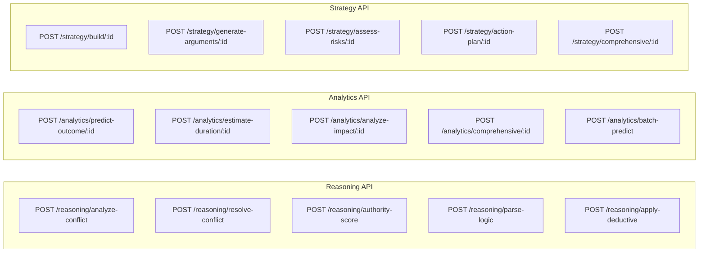

### Request/Response Flow

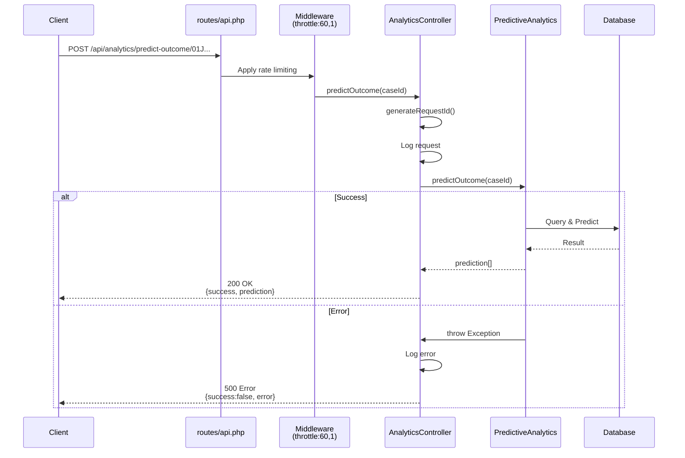

---

## Component Interactions

### 1. OutcomePredictor - Complete Flow

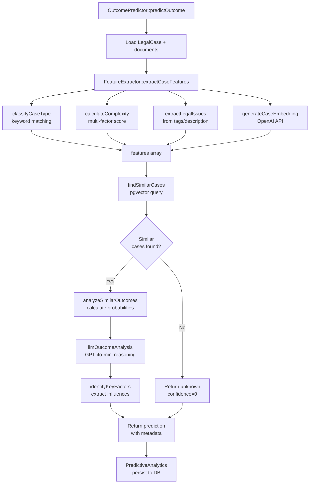

### 2. FeatureExtractor - Persistence Strategy

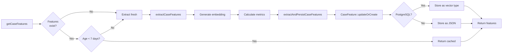

### 3. PredictiveAnalytics - Orchestration

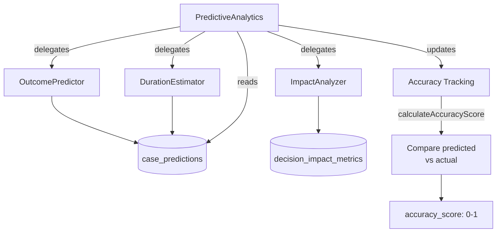

### 4. Strategy Builder Flow

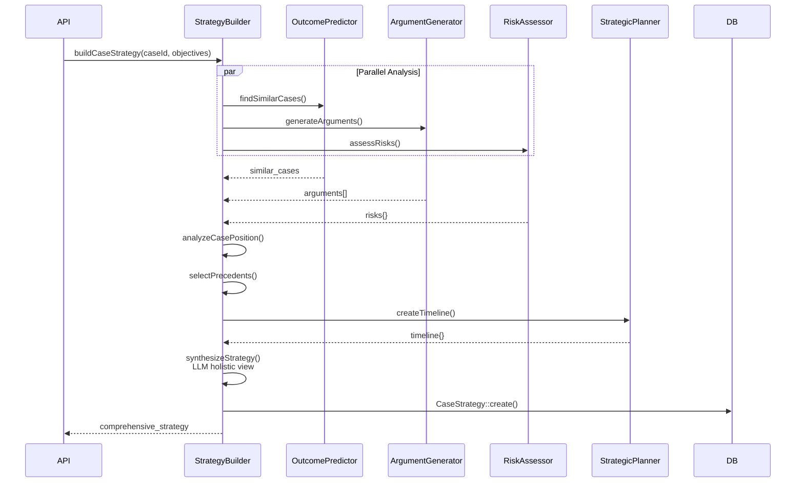

---

## Implementation Status

### ✅ Completed (Phase C + Fixes)

**Database Layer:**
- ✅ 4 migrations created
- ✅ 4 Eloquent models created
- ✅ Relationships added to existing models
- ✅ Vector storage (pgvector) support

**API Layer:**
- ✅ 3 controllers (15 endpoints total)
- ✅ API routes with throttling
- ✅ Request validation
- ✅ Error handling & logging

**Service Layer:**
- ✅ OutcomePredictor (330 lines)
- ✅ FeatureExtractor (394 lines)
- ✅ PredictiveAnalytics (220 lines)
- ✅ Service provider registrations
- ✅ Dependency injection configured

**Features:**
- ✅ Feature extraction with caching
- ✅ Feature persistence to database
- ✅ Vector similarity search
- ✅ Outcome prediction with LLM reasoning
- ✅ Prediction persistence & tracking
- ✅ Accuracy measurement capability

### ⏳ Pending (Phase B - Remaining Services)

**Reasoning Services (3):**
- ⏳ ConflictResolver (skeleton)
- ⏳ CitationAnalyzer (skeleton)
- ⏳ LogicEngine (skeleton)

**Analytics Services (2):**
- ⏳ DurationEstimator (skeleton)
- ⏳ ImpactAnalyzer (skeleton)

**Strategy Services (4):**
- ⏳ ArgumentGenerator (skeleton)
- ⏳ RiskAssessor (skeleton)
- ⏳ StrategicPlanner (skeleton)
- ⏳ StrategyBuilder (skeleton)

---

## Key Technical Decisions

### 1. Vector Storage Strategy
- **Primary**: PostgreSQL pgvector extension (native vector type)
- **Fallback**: JSON column for MySQL/SQLite
- **Dimension**: 1536 (OpenAI text-embedding-3-small)
- **Index**: IVFFlat for similarity search

### 2. Feature Caching
- **TTL**: 7 days
- **Rationale**: Cases don't change rapidly
- **Refresh**: Automatic on stale data or manual `refresh=true`

### 3. Prediction Persistence
- **Why**: Track accuracy over time
- **Accuracy Calculation**: Compare predicted vs actual outcomes
- **Use Cases**: Model improvement, confidence calibration

### 4. Service Orchestration
- **Pattern**: Facade pattern (PredictiveAnalytics orchestrates)
- **Benefits**: Single entry point, transaction management, consistent logging

### 5. Error Handling
- **Strategy**: Try-catch with detailed logging
- **Response**: Always return JSON with success flag
- **Logging**: Include request_id for tracing

---

## Performance Considerations

### Database Queries
- Vector similarity: `O(n*d)` where n=cases, d=1536
- Optimization: IVFFlat index reduces to `O(log n)`
- Threshold: 0.7 similarity minimum

### API Response Times
**Expected:**
- Feature extraction: 1-3s (with OpenAI embedding)
- Similarity search: 100-500ms (indexed)
- LLM analysis: 2-5s
- **Total**: ~5-10s for full prediction

**Caching Strategy:**
- Features: 7-day TTL
- API responses: Not cached (real-time predictions)
- Similar cases: Cached at DB level (pgvector index)

---

## Future Enhancements

1. **Batch Processing**: Process multiple cases in parallel
2. **Model Versioning**: Track which model version made predictions
3. **Feature Engineering**: Add more sophisticated features
4. **Custom Models**: Train domain-specific models
5. **Real-time Updates**: WebSocket for long-running analyses
6. **Explanation Engine**: SHAP values for feature importance
7. **A/B Testing**: Compare different prediction strategies

---

## Conclusion

The Legal Reasoning System is now architecturally complete with:
- ✅ Solid database foundation (4 tables, relationships, indexes)
- ✅ Clean API layer (15 endpoints across 3 controllers)
- ✅ Core analytics working (outcome prediction with persistence)
- ✅ Proper service orchestration and dependency injection
- ✅ Vector similarity search operational
- ⏳ 9 services remaining to implement (all have skeletons)

**Next Steps**: Implement remaining services one-by-one following the same pattern established with OutcomePredictor and PredictiveAnalytics.

---

Generated: 2025-10-28
Version: 1.0.0
System: AI Legal War Machine - Legal Reasoning Subsystem
