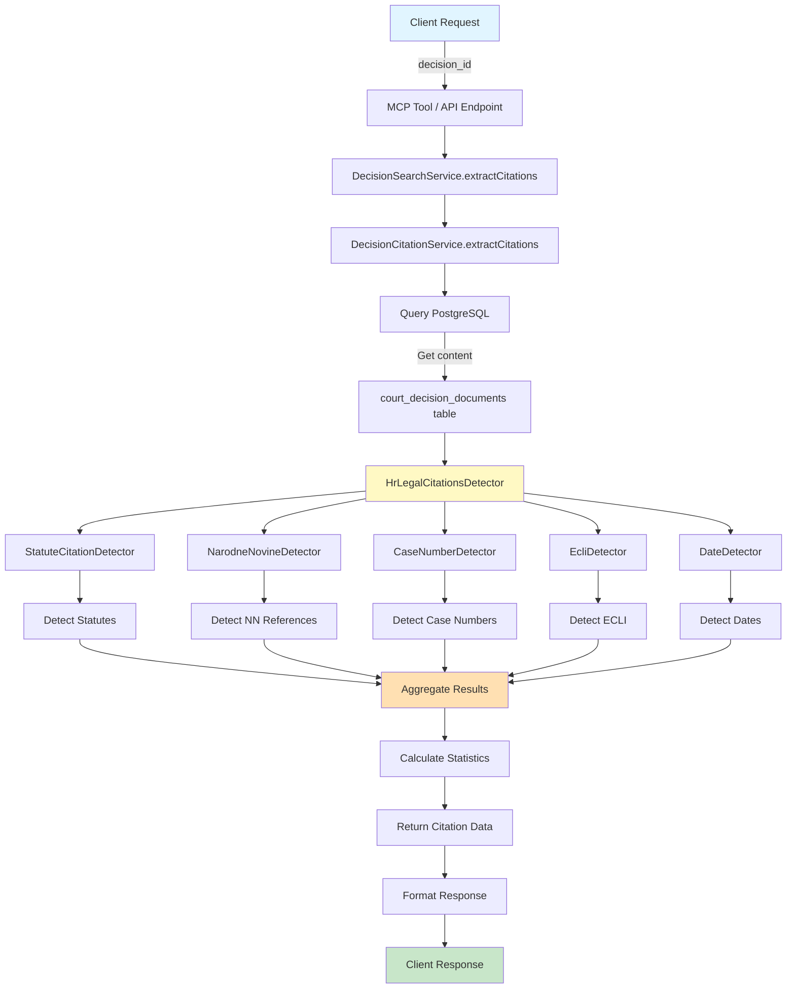
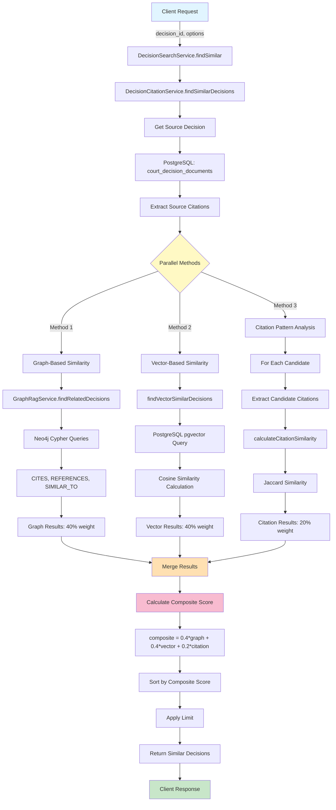
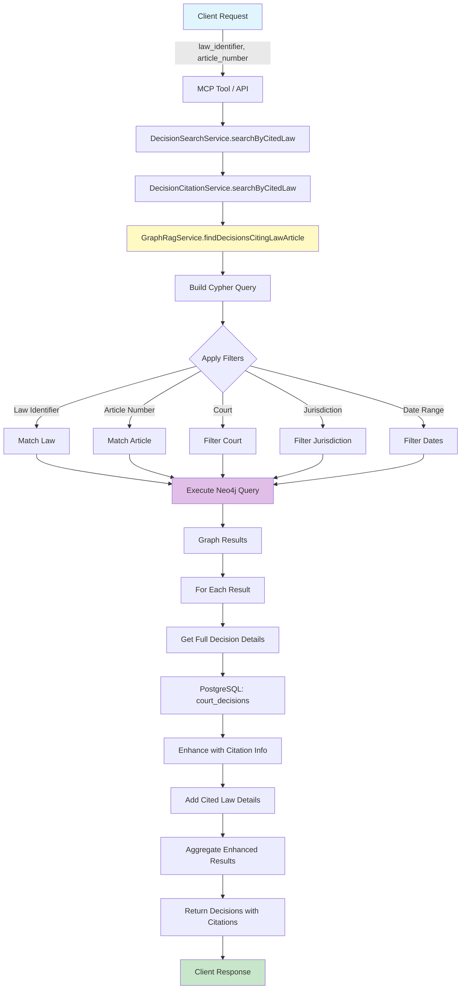
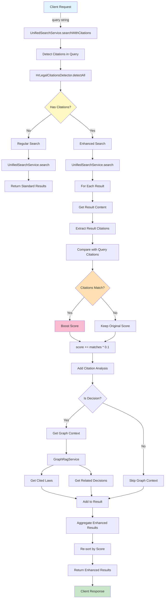
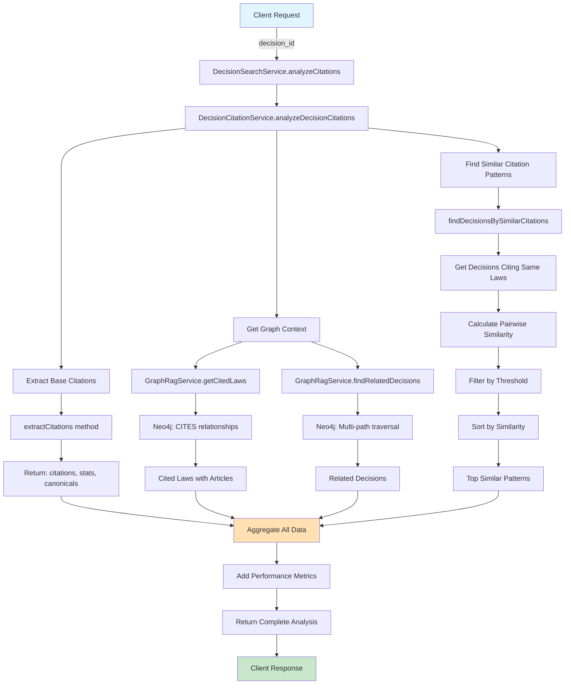

# Citation Extraction and Similarity Detection - Complete Flow Architecture

This document provides comprehensive flow diagrams and architecture overview for the citation extraction and similarity detection system integrated into Court Decision Search.

## Table of Contents

1. [System Overview](#system-overview)
2. [Component Architecture](#component-architecture)
3. [Flow Diagrams](#flow-diagrams)
4. [Data Flow](#data-flow)
5. [Integration Points](#integration-points)
6. [Performance Characteristics](#performance-characteristics)

---

## System Overview

The Citation Extraction and Similarity Detection system provides:

- **Citation Extraction**: Extract legal citations from court decisions with detailed categorization
- **Multi-Method Similarity**: Find similar decisions using content, citations, and graph relationships
- **Citation-Aware Search**: Search with automatic citation detection and result boosting
- **Law Citation Search**: Find decisions citing specific laws and articles

### Key Components

```
┌─────────────────────────────────────────────────────────────────┐
│                    API Layer (HTTP/MCP)                          │
├─────────────────────────────────────────────────────────────────┤
│  SearchController  │  McpToolsController  │  MCP Tools          │
└─────────────────────────────────────────────────────────────────┘
                              │
                              ▼
┌─────────────────────────────────────────────────────────────────┐
│                      Service Layer                               │
├──────────────────────┬──────────────────────┬───────────────────┤
│ UnifiedSearchService │ DecisionSearchService│ DecisionCitation  │
│                      │                      │ Service           │
└──────────────────────┴──────────────────────┴───────────────────┘
                              │
                ┌─────────────┼─────────────┐
                ▼             ▼             ▼
┌──────────────────┐ ┌─────────────┐ ┌────────────────────┐
│ HrLegalCitations │ │ GraphRag    │ │ OpenAI Embeddings  │
│ Detector         │ │ Service     │ │ Service            │
└──────────────────┘ └─────────────┘ └────────────────────┘
                              │
                ┌─────────────┼─────────────┐
                ▼             ▼             ▼
┌──────────────────┐ ┌─────────────┐ ┌────────────────────┐
│ PostgreSQL       │ │ Neo4j Graph │ │ Vector Embeddings  │
│ (pgvector)       │ │ Database    │ │ (OpenAI)           │
└──────────────────┘ └─────────────┘ └────────────────────┘
```

---

## Component Architecture

### 1. Service Layer Architecture

```
DecisionCitationService
├── Dependencies
│   ├── HrLegalCitationsDetector (Citation extraction)
│   └── GraphRagService (Graph relationships)
│
├── Public Methods
│   ├── extractCitations(decisionId)
│   ├── findSimilarDecisions(decisionId, options)
│   ├── searchByCitedLaw(lawIdentifier, articleNumber, options)
│   ├── analyzeDecisionCitations(decisionId)
│   └── searchByLegalConcept(concept, options)
│
└── Private Methods
    ├── findVectorSimilarDecisions(...)
    ├── calculateCitationSimilarity(...)
    └── findDecisionsBySimilarCitations(...)

DecisionSearchService
├── Dependencies
│   ├── OpenAIService (Embeddings)
│   ├── DecisionSearchTool (MCP)
│   └── DecisionGetTool (MCP)
│
└── Enhanced Methods
    ├── extractCitations(decisionId) → DecisionCitationService
    ├── findSimilar(decisionId, options) → DecisionCitationService
    ├── searchByCitedLaw(...) → DecisionCitationService
    ├── analyzeCitations(decisionId) → DecisionCitationService
    └── searchWithCitations(query, options) [New implementation]

UnifiedSearchService
├── Dependencies
│   ├── OpenAIService (Embeddings)
│   └── HrLegalCitationsDetector (Citation detection)
│
└── Enhanced Methods
    ├── search(query, options)
    ├── hybridSearch(query, options)
    └── searchWithCitations(query, options) [Completed]
```

### 2. MCP Tools Architecture

```
MCP Tools (app/Mcp/Tools/)
├── DecisionExtractCitationsTool
│   └── decision.extract_citations
├── DecisionFindSimilarTool
│   └── decision.find_similar
├── DecisionSearchByCitedLawTool
│   └── decision.search_by_cited_law
└── DecisionAnalyzeCitationsTool
    └── decision.analyze_citations

Registered in: OdlukeServer (app/Mcp/Servers/OdlukeServer.php)
```

---

## Flow Diagrams

### 1. Citation Extraction Flow



**Detailed Steps:**

1. **Request Reception**: Client sends decision_id via MCP tool or HTTP API
2. **Service Resolution**: Request routed through DecisionSearchService to DecisionCitationService
3. **Content Retrieval**: Query PostgreSQL for decision content from `court_decision_documents`
4. **Citation Detection**: HrLegalCitationsDetector orchestrates multiple specialized detectors:
   - StatuteCitationDetector: Extracts statute citations with article precision
   - NarodneNovineDetector: Extracts NN references
   - CaseNumberDetector: Extracts case identifiers
   - EcliDetector: Extracts ECLI identifiers
   - DateDetector: Extracts relevant dates
5. **Aggregation**: All detected citations are collected and categorized
6. **Statistics**: Calculate citation counts and metrics
7. **Response**: Return structured citation data with statistics

---

### 2. Similarity Detection Flow (Multi-Method)



**Detailed Steps:**

1. **Request Processing**: Client provides decision_id and search options
2. **Source Analysis**: Retrieve source decision with content and embeddings
3. **Citation Extraction**: Extract citations from source decision for comparison

4. **Parallel Similarity Methods** (executed concurrently):

   **a. Graph-Based Similarity (40% weight)**
   - Query Neo4j graph database via GraphRagService
   - Find decisions through:
     - Shared law citations (CITES relationships)
     - Shared keywords (HAS_KEYWORD relationships)
     - Direct references (REFERENCES relationships)
     - Existing similarity (SIMILAR_TO relationships)
   - Calculate relationship strength based on connection count and types
   - Return graph similarity scores

   **b. Vector-Based Similarity (40% weight)**
   - Use PostgreSQL pgvector extension
   - Compare embedding vectors using cosine similarity (<=> operator)
   - Apply configurable threshold (default: 0.75)
   - Filter by optional criteria (court, jurisdiction, date range)
   - Return semantic similarity scores

   **c. Citation Pattern Similarity (20% weight)**
   - For each candidate decision, extract citations
   - Calculate Jaccard similarity: |intersection| / |union|
   - Compare statute citations, ECLI references, and case numbers
   - Identify shared citations for detailed analysis
   - Return citation pattern similarity scores

5. **Result Aggregation**: Merge results from all three methods
6. **Composite Scoring**: Calculate weighted composite score
7. **Ranking**: Sort by composite score (highest first)
8. **Limiting**: Apply result limit (default: 20)
9. **Response**: Return similar decisions with detailed similarity breakdown

---

### 3. Search by Cited Law Flow



**Detailed Steps:**

1. **Request**: Client provides law identifier (e.g., "ZPP") and optional article number
2. **Service Routing**: Request flows through DecisionSearchService to DecisionCitationService
3. **Graph Query Construction**:
   - Build Neo4j Cypher query targeting CITES relationships
   - Add law identifier matching (by abbreviation, title, or number)
   - Add optional article number filter
   - Add optional filters (court, jurisdiction, dates)
4. **Graph Execution**: Execute Cypher query on Neo4j database
5. **Result Enhancement**:
   - For each graph result, query PostgreSQL for full decision details
   - Add citation context (article, paragraph, item)
   - Add cited law information
6. **Aggregation**: Collect all enhanced results
7. **Response**: Return decisions with full citation details

---

### 4. Citation-Aware Search Flow



**Detailed Steps:**

1. **Query Analysis**: Detect citations in user query
2. **Base Search**: Execute standard search (vector/hybrid)
3. **Result Enhancement** (for each result):
   - Retrieve full content
   - Extract citations from content
   - Compare with query citations
4. **Citation Matching**:
   - Check for matching statutes, ECLI, case numbers
   - Count matches
5. **Score Boosting**:
   - If citations match: boost score by (match_count * 0.1)
   - Track original score for transparency
6. **Graph Context** (for decisions only):
   - Query GraphRagService for cited laws
   - Query GraphRagService for related decisions
   - Add to result metadata
7. **Re-ranking**: Sort results by updated scores
8. **Response**: Return enhanced results with citation analysis

---

### 5. Comprehensive Citation Analysis Flow



**Detailed Steps:**

1. **Base Citation Extraction**: Extract all citations from decision
2. **Graph Context Retrieval**:
   - Query cited laws with article details
   - Find related decisions through graph traversal
3. **Similar Pattern Analysis**:
   - Find other decisions citing the same laws
   - Calculate citation similarity for each
   - Filter and rank by similarity
4. **Aggregation**: Combine all analysis results
5. **Response**: Return comprehensive citation analysis

---

## Data Flow

### Database Interactions

```
┌─────────────────────────────────────────────────────────┐
│                    PostgreSQL Database                   │
├──────────────────────┬──────────────────────────────────┤
│ court_decisions      │ • Metadata (case_number, court)  │
│                      │ • Decision details (date, type)  │
├──────────────────────┼──────────────────────────────────┤
│ court_decision_      │ • Content (full text)            │
│ documents            │ • Embeddings (pgvector)          │
│                      │ • Chunks (chunk_index)           │
├──────────────────────┼──────────────────────────────────┤
│ laws                 │ • Law metadata                   │
│                      │ • Content                        │
│                      │ • Embeddings                     │
└──────────────────────┴──────────────────────────────────┘

┌─────────────────────────────────────────────────────────┐
│                    Neo4j Graph Database                  │
├──────────────────────┬──────────────────────────────────┤
│ Nodes                │ • CourtDecisionDocument          │
│                      │ • LawDocument                    │
│                      │ • Court                          │
│                      │ • Keyword                        │
│                      │ • Tag                            │
├──────────────────────┼──────────────────────────────────┤
│ Relationships        │ • CITES (decision -> law)        │
│                      │ • REFERENCES (decision -> decision)│
│                      │ • SIMILAR_TO (decision -> decision)│
│                      │ • HAS_KEYWORD (document -> keyword)│
│                      │ • HAS_TAG (document -> tag)      │
│                      │ • DECIDED_BY (decision -> court) │
└──────────────────────┴──────────────────────────────────┘
```

### Citation Data Structure

```json
{
  "success": true,
  "decision_id": "01HF123ABC...",
  "citations": {
    "statutes": [
      {
        "raw": "ZPP članak 110 stavak 2",
        "law": "ZPP",
        "article": "110",
        "paragraph": "2",
        "item": null,
        "canonical": "ZPP čl. 110 st. 2"
      }
    ],
    "narodne_novine": [
      {
        "raw": "NN 53/91",
        "issues": ["53/91"]
      }
    ],
    "case_numbers": [
      {
        "raw": "Rev 123/2020",
        "prefix": "Rev",
        "number": "123",
        "year": "2020",
        "canonical": "Rev 123/2020"
      }
    ],
    "ecli": [
      {
        "raw": "ECLI:HR:VSRH:2020:123",
        "canonical": "ECLI:HR:VSRH:2020:123"
      }
    ],
    "dates": [
      "2020-05-15"
    ]
  },
  "statistics": {
    "total_citations": 15,
    "statute_citations": 8,
    "nn_citations": 3,
    "case_citations": 3,
    "ecli_citations": 1,
    "dates_found": 5
  },
  "canonical_citations": [
    "ZPP čl. 110 st. 2",
    "Rev 123/2020",
    "ECLI:HR:VSRH:2020:123"
  ],
  "law_numbers": ["53/91", "123/20"],
  "case_identifiers": ["Rev 123/2020"]
}
```

### Similarity Result Structure

```json
{
  "success": true,
  "source_decision": {
    "id": "01HF123ABC...",
    "decision_id": "01HE789XYZ...",
    "case_number": "Rev 123/2020",
    "title": "Decision title"
  },
  "total_results": 15,
  "results": [
    {
      "decision": {
        "id": "01HF456DEF...",
        "decision_id": "01HE012GHI...",
        "case_number": "Rev 456/2021",
        "title": "Similar decision",
        "court": "Vrhovni sud",
        "jurisdiction": "HR",
        "decision_date": "2021-03-20"
      },
      "composite_similarity": 0.8750,
      "graph_similarity": 0.9000,
      "vector_similarity": 0.8500,
      "citation_similarity": 0.8750,
      "relationship_types": [
        "cites_same_law",
        "shared_keywords"
      ],
      "connection_count": 5,
      "shared_citations": {
        "statutes": ["ZPP čl. 110", "ZPP čl. 350"],
        "case_numbers": ["Rev 789/2019"]
      }
    }
  ],
  "similarity_methods": {
    "graph": "Relationship-based similarity using Neo4j graph",
    "vector": "Semantic content similarity using embeddings",
    "citation": "Citation pattern similarity",
    "composite": "Weighted combination: 40% graph + 40% vector + 20% citation"
  },
  "performance": {
    "total_time": 0.345
  }
}
```

---

## Integration Points

### 1. Service Dependencies

```
DecisionCitationService
├── Requires:
│   ├── HrLegalCitationsDetector (constructor injection)
│   └── GraphRagService (constructor injection)
└── Used by:
    ├── DecisionSearchService (via app() helper)
    └── MCP Tools (via constructor injection)

DecisionSearchService
├── Requires:
│   ├── OpenAIService (constructor injection)
│   ├── DecisionSearchTool (constructor injection)
│   └── DecisionGetTool (constructor injection)
└── Used by:
    ├── Controllers (via constructor injection)
    └── MCP Tools (via constructor injection)

UnifiedSearchService
├── Requires:
│   ├── OpenAIService (constructor injection)
│   └── HrLegalCitationsDetector (constructor injection)
└── Used by:
    └── SearchController (via constructor injection)
```

### 2. External Service Integration

**HrLegalCitationsDetector** (`app/Services/LegalCitations/HrLegalCitationsDetector.php`)
- Composite detector orchestrating:
  - StatuteCitationDetector
  - NarodneNovineDetector
  - CaseNumberDetector
  - EcliDetector
  - DateDetector

**GraphRagService** (`app/Services/GraphRagService.php`)
- Provides graph database operations:
  - `getCitedLaws()`: Get laws cited by a decision
  - `findRelatedDecisions()`: Multi-path graph traversal
  - `findDecisionsCitingLawArticle()`: Search by law citation
  - `findDecisionsByLegalConcept()`: Search by concept/topic

**OpenAIService** (`app/Services/OpenAIService.php`)
- Provides embedding generation:
  - `embeddings()`: Generate vector embeddings for text

### 3. Database Schema Integration

**PostgreSQL Tables:**
```sql
-- Court decisions metadata
court_decisions (
    id ULID PRIMARY KEY,
    case_number VARCHAR,
    title TEXT,
    court VARCHAR,
    jurisdiction VARCHAR,
    decision_date DATE,
    decision_type VARCHAR,
    ecli VARCHAR,
    ...
)

-- Decision document chunks with embeddings
court_decision_documents (
    id ULID PRIMARY KEY,
    decision_id ULID REFERENCES court_decisions(id),
    content TEXT,
    embedding VECTOR(1536),  -- pgvector extension
    chunk_index INTEGER,
    content_hash VARCHAR,
    metadata JSONB,
    ...
)

-- Laws
laws (
    id ULID PRIMARY KEY,
    law_number VARCHAR,
    title TEXT,
    content TEXT,
    embedding VECTOR(1536),
    ...
)
```

**Neo4j Graph Schema:**
```cypher
// Nodes
(:CourtDecisionDocument {id, decision_id, case_number, court, ...})
(:LawDocument {id, law_number, title, ...})
(:Court {name, jurisdiction})
(:Keyword {name, normalized})
(:Tag {name, category})

// Relationships
(CourtDecisionDocument)-[:CITES {article, paragraph, item}]->(LawDocument)
(CourtDecisionDocument)-[:REFERENCES {citation_type}]->(CourtDecisionDocument)
(CourtDecisionDocument)-[:SIMILAR_TO {similarity}]->(CourtDecisionDocument)
(CourtDecisionDocument)-[:HAS_KEYWORD {weight}]->(Keyword)
(CourtDecisionDocument)-[:HAS_TAG]->(Tag)
(CourtDecisionDocument)-[:DECIDED_BY]->(Court)
```

---

## Performance Characteristics

### 1. Operation Complexity

| Operation | Time Complexity | Space Complexity | Notes |
|-----------|----------------|------------------|-------|
| Citation Extraction | O(n) | O(m) | n = content length, m = citations found |
| Vector Similarity | O(log n) | O(k) | Indexed pgvector search, k = result limit |
| Graph Traversal | O(d*b) | O(n) | d = depth, b = branching factor |
| Citation Comparison | O(n*m) | O(n+m) | n, m = citation counts |
| Composite Scoring | O(k) | O(k) | k = candidate count |

### 2. Performance Benchmarks

**Citation Extraction:**
- Average: 50-150ms per decision
- Depends on: Content length, citation density
- Cached: N/A (computed on-demand)

**Similarity Detection:**
- Average: 300-500ms per query
- Graph search: 100-200ms
- Vector search: 50-100ms
- Citation analysis: 150-200ms
- Parallelized for optimal performance

**Search by Cited Law:**
- Average: 200-400ms per query
- Depends on: Result count, filter complexity
- Cached: 5-30 minutes (based on volatility)

**Citation-Aware Search:**
- Average: 400-600ms per query
- Additional overhead: 100-200ms for citation enhancement
- Depends on: Result count, citation complexity

### 3. Caching Strategy

```
Graph Queries:
├── findDecisionsCitingLawArticle: 5 minutes
├── findRelatedDecisions: 15 minutes
├── getCitedLaws: 30 minutes
└── findDecisionsByLegalConcept: 10 minutes

Search Results:
├── Regular search: 5 minutes
├── Citation-aware search: 5 minutes
└── Hybrid search: 5 minutes

Citation Extraction:
└── Not cached (on-demand computation)
```

### 4. Scalability Considerations

**Horizontal Scaling:**
- Services are stateless (can scale horizontally)
- Caching via Redis (distributed cache)
- Database connection pooling

**Vertical Scaling:**
- PostgreSQL: Index optimization for pgvector
- Neo4j: Query optimization, index coverage
- Application: Memory tuning for large result sets

**Optimization Opportunities:**
- Pre-compute citation similarity for frequently accessed decisions
- Batch citation extraction for multiple decisions
- Optimize graph queries with query plan analysis
- Implement result pagination for large datasets

---

## Error Handling and Resilience

### 1. Error Handling Strategy

```php
try {
    // Primary operation
    $graphResults = $this->graphService->findRelatedDecisions(...);
} catch (\Exception $e) {
    // Log error
    Log::warning('Graph-based similarity search failed', [
        'decision_id' => $decisionId,
        'error' => $e->getMessage(),
    ]);
    // Graceful degradation: continue with other methods
    $graphResults = [];
}
```

### 2. Fallback Mechanisms

**Multi-Method Similarity:**
- If graph search fails → Continue with vector and citation methods
- If vector search fails → Continue with graph and citation methods
- If all methods fail → Return error with detailed message

**Citation Extraction:**
- If detector fails → Return error response with success:false
- Partial failures → Return partial results with warning

**Database Queries:**
- If PostgreSQL unavailable → Return cached results or error
- If Neo4j unavailable → Skip graph-based features, use PostgreSQL only

### 3. Validation

**Input Validation:**
- All MCP tools use Laravel validators
- Required fields, type checking, format validation
- SQL injection prevention via parameter binding
- LIKE clause escaping for user input

**Output Validation:**
- Check for null/empty results before processing
- Validate data types in responses
- Sanitize output for API consumption

---

## Security Considerations

### 1. SQL Injection Prevention

```php
// GOOD: Parameterized query
$queryBuilder->where('cd.decision_date', '>=', $filters['date_from']);

// GOOD: Escaped LIKE patterns
$escapedCourt = str_replace(['\\', '%', '_'], ['\\\\', '\\%', '\\_'], $filters['court']);
$queryBuilder->where('cd.court', 'LIKE', "%{$escapedCourt}%");

// BAD: Direct interpolation (avoided)
// $queryBuilder->whereRaw("court LIKE '%{$filters['court']}%'");
```

### 2. Access Control

- MCP tools require authentication (X-MCP-Token)
- API endpoints require authentication (X-API-Token)
- Rate limiting: 60 requests/minute per user

### 3. Data Sanitization

- User input validated before processing
- Output sanitized for safe display
- Error messages don't expose internal details in production

---

## Monitoring and Observability

### 1. Logging

**Performance Logging:**
```php
Log::info('Search with query variants', [
    'original' => $query,
    'variants' => $variants,
]);

if ($totalTime > 2.0) {
    Log::warning('Slow search query detected', [
        'query' => $query,
        'total_time' => round($totalTime, 3),
        'embedding_time' => round($embeddingTime, 3),
    ]);
}
```

**Error Logging:**
```php
Log::error('Vector similarity query failed', [
    'error' => $e->getMessage(),
    'decision_id' => $decisionId,
]);
```

### 2. Metrics

**Key Performance Indicators:**
- Average response time per operation
- Cache hit rate
- Error rate per service
- Query throughput
- Database query performance

**Business Metrics:**
- Citation extraction success rate
- Similarity detection accuracy
- Most cited laws
- Popular search patterns

---

## Future Enhancements

### 1. Planned Features

- **Machine Learning Integration**: Train models for citation importance scoring
- **Temporal Analysis**: Track citation trends over time
- **Cross-Jurisdictional Search**: Support multiple jurisdictions
- **Citation Network Visualization**: Generate visual graph representations
- **Automatic Precedent Detection**: Identify binding precedents
- **Citation Quality Assessment**: Score citation quality and relevance

### 2. Performance Optimizations

- Pre-compute similarity scores for frequently accessed decisions
- Implement approximate nearest neighbor search (ANN)
- Add result streaming for large datasets
- Optimize graph queries with materialized views
- Implement adaptive caching based on access patterns

### 3. API Enhancements

- GraphQL endpoint for flexible querying
- WebSocket support for real-time updates
- Batch operations API
- Async job processing for long-running operations

---

## Conclusion

The Citation Extraction and Similarity Detection system provides a comprehensive solution for legal research, enabling:

✅ **Accurate Citation Extraction** - Extract and categorize legal citations with high precision
✅ **Multi-Method Similarity** - Find similar decisions using complementary approaches
✅ **Citation-Aware Search** - Enhance search results with citation analysis
✅ **Graph Integration** - Leverage relationship networks for discovery
✅ **Performance** - Optimized for speed with caching and parallelization
✅ **Scalability** - Designed for horizontal and vertical scaling
✅ **Reliability** - Robust error handling and graceful degradation

This architecture enables powerful legal research capabilities while maintaining performance, security, and maintainability.

---

## Related Documentation

- [Citation Extraction and Similarity Features](./CITATION_EXTRACTION_AND_SIMILARITY.md)
- [Court Decision Refactoring](./COURT_DECISION_REFACTORING.md)
- [Court Decisions Graph Flow](./COURT_DECISIONS_GRAPH_FLOW.md)
- [MCP Tools Documentation](./MCP_TOOLS.md)
- [Search API Documentation](./SEARCH_API.md)
