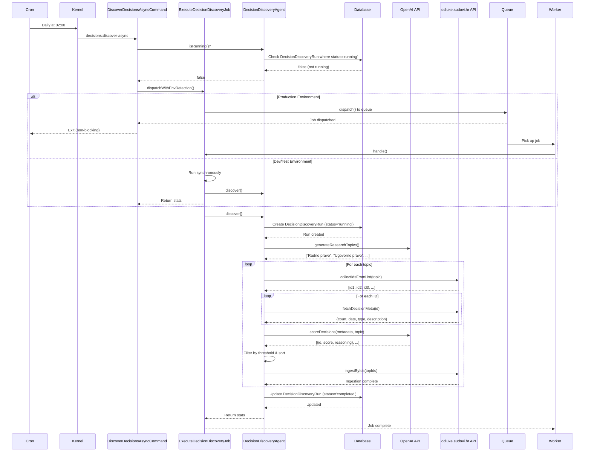

# Decision Discovery - Async Queue Flow

## Overview

The Decision Discovery system has been refactored to use Laravel queues for asynchronous, non-blocking execution. This prevents the scheduler from blocking during long-running discovery operations and enables better scalability.

## Architecture Components

### Core Components

| Component | File | Purpose |
|-----------|------|---------|
| **Queue Job** | `app/Jobs/ExecuteDecisionDiscoveryJob.php` | Executes discovery process asynchronously |
| **Artisan Command** | `app/Console/Commands/DiscoverDecisionsAsyncCommand.php` | CLI interface for manual/scheduled execution |
| **Agent** | `app/Agents/DecisionDiscoveryAgent.php` | Core discovery logic and LLM orchestration |
| **Scheduler** | `app/Console/Kernel.php` | Cron schedule configuration |
| **Model** | `app/Models/DecisionDiscoveryRun.php` | Tracks discovery run state |

---

## Flow Diagram

```
┌─────────────────────────────────────────────────────────────────────┐
│                          SCHEDULED TRIGGER                           │
│                     (Daily at 02:00 via Cron)                       │
└────────────────────────────────┬────────────────────────────────────┘
                                 │
                                 ▼
┌─────────────────────────────────────────────────────────────────────┐
│                  app/Console/Kernel.php                              │
│                                                                       │
│  $schedule->command('decisions:discover-async')                      │
│           ->dailyAt('02:00')                                         │
│           ->name('decision-discovery-daily')                         │
│           ->onOneServer()                                            │
│           ->withoutOverlapping(60)                                   │
└────────────────────────────────┬────────────────────────────────────┘
                                 │
                                 ▼
┌─────────────────────────────────────────────────────────────────────┐
│         app/Console/Commands/DiscoverDecisionsAsyncCommand.php      │
│                                                                       │
│  1. Check DecisionDiscoveryAgent::isRunning()                       │
│     ├─ If running & !--force → Exit with warning                    │
│     └─ If not running → Continue                                    │
│                                                                       │
│  2. Parse options:                                                   │
│     - --max-decisions (optional)                                     │
│     - --topic (optional)                                             │
│     - --force (override running check)                               │
│                                                                       │
│  3. Call ExecuteDecisionDiscoveryJob::dispatchWithEnvDetection()    │
└────────────────────────────────┬────────────────────────────────────┘
                                 │
                                 ▼
                    ┌────────────────────────┐
                    │  Environment Detection  │
                    └────────────┬────────────┘
                                 │
                ┌────────────────┴────────────────┐
                │                                  │
                ▼                                  ▼
    ┌───────────────────┐            ┌───────────────────────┐
    │  LOCAL/TESTING    │            │     PRODUCTION        │
    │  (Synchronous)    │            │   (Asynchronous)      │
    └─────────┬─────────┘            └──────────┬────────────┘
              │                                  │
              │                                  ▼
              │                    ┌─────────────────────────────┐
              │                    │   Queue System (Redis)      │
              │                    │   dispatch() job to queue   │
              │                    └──────────┬──────────────────┘
              │                               │
              │                               ▼
              │                    ┌─────────────────────────────┐
              │                    │   Queue Worker Process      │
              │                    │   php artisan queue:work    │
              │                    └──────────┬──────────────────┘
              │                               │
              └───────────────────────────────┘
                                 │
                                 ▼
┌─────────────────────────────────────────────────────────────────────┐
│           app/Jobs/ExecuteDecisionDiscoveryJob.php                  │
│                                                                       │
│  handle(DecisionDiscoveryAgent $agent)                              │
│                                                                       │
│  1. Log job start                                                    │
│  2. Configure agent with options:                                    │
│     - setIngestPerTopic($maxDecisions) if provided                  │
│  3. Execute: $agent->discover()                                     │
│  4. Log completion stats                                             │
│                                                                       │
│  Timeout: 1800s (30 minutes)                                         │
│  Tries: 1 (no retry on failure)                                     │
└────────────────────────────────┬────────────────────────────────────┘
                                 │
                                 ▼
┌─────────────────────────────────────────────────────────────────────┐
│            app/Agents/DecisionDiscoveryAgent.php                    │
│                                                                       │
│  discover()                                                          │
│                                                                       │
│  1. Create DecisionDiscoveryRun record (status: 'running')          │
│     └─ Sets isRunning() flag via DB                                 │
│                                                                       │
│  2. Generate research topics via LLM                                 │
│     ├─ Check cache (1 week TTL)                                     │
│     ├─ If cached → use cached topics                                │
│     └─ If not cached → generateResearchTopics()                     │
│        ├─ LLM: OpenAI GPT-4o-mini                                   │
│        ├─ Prompt: Generate Croatian legal topics                    │
│        ├─ Response: JSON array of topics                            │
│        ├─ Cache for 1 week                                           │
│        └─ Fallback: predefined topics if LLM fails                  │
│                                                                       │
│  3. For each topic: discoverForTopic($topic)                        │
│     │                                                                 │
│     ├─ a) translateTopicToQuery($topic)                             │
│     │      └─ Convert topic to search query                          │
│     │                                                                 │
│     ├─ b) Search odluke.sudovi.hr API                               │
│     │      └─ OdlukeClient::collectIdsFromList()                    │
│     │         ├─ Max: decisionsPerTopic (default: 50)               │
│     │         └─ Returns: array of decision IDs                     │
│     │                                                                 │
│     ├─ c) Fetch metadata for all decisions                          │
│     │      └─ OdlukeClient::fetchDecisionMeta($id)                  │
│     │         └─ Returns: court, date, type, description            │
│     │                                                                 │
│     ├─ d) Score decisions via LLM                                   │
│     │      └─ scoreDecisions($metadata, $topic)                     │
│     │         ├─ Batch into groups of 10                             │
│     │         ├─ scoreBatch() for each group                         │
│     │         │  ├─ LLM: OpenAI GPT-4o-mini                          │
│     │         │  ├─ Prompt: Score 0-100 for relevance               │
│     │         │  └─ Returns: JSON with scores & reasoning            │
│     │         └─ Fallback: score 50 if LLM fails                    │
│     │                                                                 │
│     ├─ e) Filter by relevance threshold                             │
│     │      └─ Keep only: score >= relevanceThreshold (default: 70)  │
│     │                                                                 │
│     ├─ f) Sort by score and take top N                              │
│     │      └─ Top: ingestPerTopic (default: 10)                     │
│     │                                                                 │
│     └─ g) Ingest selected decisions                                 │
│            └─ OdlukeIngestService::ingestByIds($topIds)             │
│               ├─ sync_graph: true                                    │
│               ├─ chunk_chars: 1500                                   │
│               └─ overlap: 200                                        │
│                                                                       │
│  4. Update DecisionDiscoveryRun record                               │
│     ├─ status: 'completed'                                           │
│     ├─ completed_at: timestamp                                       │
│     ├─ topics_generated: count                                       │
│     ├─ decisions_evaluated: count                                    │
│     ├─ decisions_ingested: count                                     │
│     └─ Clears isRunning() flag                                       │
│                                                                       │
│  5. Return stats array                                               │
└─────────────────────────────────────────────────────────────────────┘
```

---

## Sequence Diagram



---

## Configuration Options

### Agent Configuration

Located in: `app/Agents/DecisionDiscoveryAgent.php`

| Property | Default | Description |
|----------|---------|-------------|
| `topicsPerRun` | 5 | Number of legal topics to research per run |
| `decisionsPerTopic` | 50 | Max decisions to evaluate per topic |
| `ingestPerTopic` | 10 | Max decisions to ingest per topic |
| `relevanceThreshold` | 70.0 | Minimum score (0-100) to ingest decision |

### Job Configuration

Located in: `app/Jobs/ExecuteDecisionDiscoveryJob.php`

| Property | Value | Description |
|----------|-------|-------------|
| `timeout` | 1800 seconds | Max execution time (30 minutes) |
| `tries` | 1 | Number of retry attempts |

### Command Options

```bash
php artisan decisions:discover-async [options]

Options:
  --max-decisions=N    Maximum decisions to discover (overrides ingestPerTopic)
  --topic=TOPIC        Specific topic to search (overrides topic generation)
  --force              Force run even if already running
```

### Scheduler Configuration

Located in: `app/Console/Kernel.php:26`

```php
$schedule->command('decisions:discover-async')
    ->dailyAt('02:00')                // Run at 2 AM daily
    ->name('decision-discovery-daily') // Named task for monitoring
    ->onOneServer()                    // Prevent multiple servers from running
    ->withoutOverlapping(60);          // Skip if still running after 60 min
```

---

## Concurrency Control

### How It Works

1. **Database Flag**: `DecisionDiscoveryRun` table tracks running jobs
   - Status: `'running'` | `'completed'` | `'failed'`

2. **isRunning() Check**: Static method queries database
   ```php
   DecisionDiscoveryAgent::isRunning()
   // Returns true if any run has status='running'
   ```

3. **Scheduler Protection**: `withoutOverlapping(60)`
   - Laravel creates lock file
   - Prevents duplicate scheduler executions
   - Lock expires after 60 minutes (mutex)

4. **Command-level Protection**: `--force` override
   ```bash
   # Will fail if already running
   php artisan decisions:discover-async

   # Force run (ignores isRunning check)
   php artisan decisions:discover-async --force
   ```

---

## Error Handling

### Job-level Errors

```php
try {
    $agent->discover();
} catch (\Exception $e) {
    Log::error('ExecuteDecisionDiscoveryJob - Failed', [
        'error' => $e->getMessage(),
        'trace' => $e->getTraceAsString(),
    ]);
    throw $e; // Re-throw to trigger failed()
}
```

### Failed Job Handler

```php
public function failed(\Throwable $exception): void
{
    Log::error('ExecuteDecisionDiscoveryJob - Job failed permanently');
    // No retry since tries=1
}
```

### Agent-level Errors

```php
try {
    $result = $this->discoverForTopic($topic);
} catch (\Exception $e) {
    Log::error('Error discovering for topic', [
        'topic' => $topic,
        'error' => $e->getMessage(),
    ]);
    $stats['errors'][] = [...];
    // Continue to next topic (graceful degradation)
}
```

### Database State Management

```php
// On success
$run->update([
    'status' => 'completed',
    'completed_at' => now(),
    'topics_generated' => $stats['topics_generated'],
    'decisions_evaluated' => $stats['decisions_evaluated'],
    'decisions_ingested' => $stats['decisions_ingested'],
]);

// On failure
$run->update([
    'status' => 'failed',
    'error_message' => $e->getMessage(),
    'completed_at' => now(),
]);
```

---

## Environment Detection

### Development (local/testing)

```php
if (app()->environment('local', 'testing')) {
    // Run synchronously
    $agent = app(DecisionDiscoveryAgent::class);
    $stats = $agent->discover();

    return [
        'mode' => 'sync',
        'stats' => $stats,
    ];
}
```

**Benefits**:
- Immediate feedback during development
- No need to run queue workers
- Easier debugging with stack traces

### Production

```php
else {
    // Dispatch to queue
    self::dispatch($maxDecisions, $topic);

    return [
        'mode' => 'async',
        'message' => 'Job dispatched to queue',
    ];
}
```

**Benefits**:
- Non-blocking execution
- Scalable with multiple workers
- Job retry and monitoring via Horizon/queue dashboard

---

## Monitoring & Logging

### Log Events

| Event | Location | Log Level |
|-------|----------|-----------|
| Job started | `ExecuteDecisionDiscoveryJob::handle()` | INFO |
| Job completed | `ExecuteDecisionDiscoveryJob::handle()` | INFO |
| Job failed | `ExecuteDecisionDiscoveryJob::failed()` | ERROR |
| Agent discovery started | `DecisionDiscoveryAgent::discover()` | INFO |
| Topics generated | `DecisionDiscoveryAgent::generateResearchTopics()` | INFO |
| Topic discovery started | `DecisionDiscoveryAgent::discoverForTopic()` | INFO |
| Decisions scored | `DecisionDiscoveryAgent::scoreDecisions()` | INFO |
| Discovery completed | `DecisionDiscoveryAgent::discover()` | INFO |
| LLM error | `DecisionDiscoveryAgent::scoreBatch()` | ERROR |

### Database Tracking

Query recent runs:
```php
$runs = DecisionDiscoveryRun::latest()
    ->take(10)
    ->get(['id', 'status', 'topics_generated', 'decisions_evaluated', 'decisions_ingested', 'started_at', 'completed_at']);
```

Check if running:
```php
$isRunning = DecisionDiscoveryAgent::isRunning();
```

### Queue Monitoring

```bash
# Monitor queue in real-time
php artisan queue:listen

# Check failed jobs
php artisan queue:failed

# Retry failed job
php artisan queue:retry <job-id>
```

### Laravel Horizon (Optional)

If Horizon is installed:
- Dashboard: `http://your-app.test/horizon`
- Metrics: throughput, runtime, failures
- Job details: payload, exceptions, attempts

---

## Deployment Checklist

### Prerequisites

- [ ] Queue driver configured (Redis recommended)
  ```env
  QUEUE_CONNECTION=redis
  REDIS_HOST=127.0.0.1
  REDIS_PORT=6379
  ```

- [ ] OpenAI API key configured
  ```env
  OPENAI_API_KEY=sk-...
  ```

- [ ] Odluke API accessible
  ```env
  ODLUKE_BASE_URL=https://odluke.sudovi.hr
  ```

### Queue Worker Setup

#### Systemd Service (Production)

Create: `/etc/systemd/system/queue-worker.service`

```ini
[Unit]
Description=Laravel Queue Worker
After=network.target

[Service]
Type=simple
User=www-data
Group=www-data
WorkingDirectory=/var/www/html
ExecStart=/usr/bin/php /var/www/html/artisan queue:work redis --sleep=3 --tries=1 --max-time=3600
Restart=always
RestartSec=5

[Install]
WantedBy=multi-user.target
```

Enable and start:
```bash
sudo systemctl enable queue-worker
sudo systemctl start queue-worker
sudo systemctl status queue-worker
```

#### Supervisor (Alternative)

Create: `/etc/supervisor/conf.d/laravel-worker.conf`

```ini
[program:laravel-worker]
process_name=%(program_name)s_%(process_num)02d
command=php /var/www/html/artisan queue:work redis --sleep=3 --tries=1 --max-time=3600
autostart=true
autorestart=true
stopasgroup=true
killasgroup=true
user=www-data
numprocs=1
redirect_stderr=true
stdout_logfile=/var/www/html/storage/logs/worker.log
stopwaitsecs=3600
```

Reload supervisor:
```bash
sudo supervisorctl reread
sudo supervisorctl update
sudo supervisorctl start laravel-worker:*
```

### Cron Setup

Ensure Laravel scheduler is running:

```bash
crontab -e
```

Add:
```
* * * * * cd /var/www/html && php artisan schedule:run >> /dev/null 2>&1
```

### Verify Deployment

```bash
# Test command manually
php artisan decisions:discover-async --force

# Check logs
tail -f storage/logs/laravel.log

# Verify scheduler entry
php artisan schedule:list | grep decision-discovery

# Check queue connection
php artisan queue:work --once
```

---

## Performance Considerations

### Expected Runtime

| Phase | Duration | Notes |
|-------|----------|-------|
| Topic generation | 5-10s | Single LLM call, cached for 1 week |
| Decision search | 2-5s per topic | API latency dependent |
| Metadata fetch | 0.1-0.5s per decision | 50 decisions = 5-25s per topic |
| Decision scoring | 10-20s per batch | 10 decisions per batch, 5 batches = 50-100s |
| Ingestion | 10-30s per decision | File downloads + processing |
| **Total per topic** | **2-5 minutes** | Varies by API performance |
| **Total per run** | **10-25 minutes** | 5 topics default |

### Optimization Strategies

1. **Increase Cache TTL**: Topics cached for 1 week (reduce LLM calls)
2. **Batch Processing**: Score 10 decisions per LLM call (reduce API overhead)
3. **Adjust Thresholds**: Increase `relevanceThreshold` to ingest fewer decisions
4. **Reduce Scope**: Decrease `topicsPerRun` or `decisionsPerTopic`
5. **Parallel Workers**: Run multiple queue workers (scale horizontally)

### Resource Usage

| Resource | Usage | Notes |
|----------|-------|-------|
| **Memory** | 128-256 MB | Depends on decision size |
| **CPU** | Low | I/O bound (API calls) |
| **Network** | High | Multiple API requests |
| **Database** | Low | Single run record + metadata |
| **OpenAI Tokens** | 5,000-10,000 | Per run (topics + scoring) |

---

## Troubleshooting

### Job Not Running

**Symptom**: Job dispatched but never executes

**Solutions**:
```bash
# Check queue worker status
ps aux | grep "queue:work"

# Verify Redis connection
php artisan tinker
>>> Redis::ping()

# Check failed jobs
php artisan queue:failed

# Restart queue worker
sudo systemctl restart queue-worker
```

### Job Timeout

**Symptom**: Job exceeds 30-minute timeout

**Solutions**:
- Reduce `decisionsPerTopic` in agent configuration
- Increase `timeout` in job class
- Check external API response times (Odluke API)

### Duplicate Runs

**Symptom**: Multiple jobs running simultaneously

**Solutions**:
```bash
# Check database
SELECT * FROM decision_discovery_runs WHERE status = 'running';

# Manually mark as completed if stuck
UPDATE decision_discovery_runs SET status = 'completed', completed_at = NOW() WHERE id = X;

# Verify scheduler mutex
rm storage/framework/schedule-*
```

### LLM Failures

**Symptom**: Topics/scores fallback to defaults

**Solutions**:
```bash
# Check OpenAI API key
php artisan tinker
>>> config('services.openai.key')

# Test API connection
>>> app(App\Services\OpenAIService::class)->chat([...])

# Review logs
tail -f storage/logs/laravel.log | grep "LLM"
```

---

## Migration from Old System

### Before (Blocking Command)

```php
// Scheduler ran blocking command
$schedule->command('decisions:discover')
    ->daily()
    ->at('02:00');

// Cron would wait 10-25 minutes for completion
// Other scheduled tasks would be delayed
```

### After (Queue Job)

```php
// Scheduler dispatches job and exits immediately
$schedule->command('decisions:discover-async')
    ->dailyAt('02:00');

// Job runs in background via queue worker
// Other scheduled tasks run on time
```

### Breaking Changes

❌ **Removed**: `emailOutputOnFailure()` from scheduler
- Job failures are logged but not emailed
- **Migration**: Implement custom failure notification in `failed()` method

✅ **Added**: Environment-aware execution
- Dev: synchronous (immediate feedback)
- Production: asynchronous (scalable)

✅ **Added**: Concurrency control
- `isRunning()` check prevents overlaps
- `--force` flag for manual override

---

## Future Enhancements

### Planned Improvements

1. **Event Broadcasting**
   - Emit `DiscoveryStarted`, `DiscoveryCompleted`, `DiscoveryFailed` events
   - Enable real-time UI updates via WebSockets

2. **Chunked Ingestion**
   - Split large ingestion batches into smaller sub-jobs
   - Improve progress tracking

3. **Retry Strategy**
   - Implement exponential backoff for transient API failures
   - Separate retry logic for LLM vs Odluke API

4. **Metrics Dashboard**
   - Track success rate over time
   - Monitor topic diversity and coverage
   - Alert on consecutive failures

5. **Configurable Scheduling**
   - Allow dynamic schedule changes via admin UI
   - Support multiple discovery profiles (fast, thorough, targeted)

---

## References

### Related Files

- `app/Jobs/ExecuteDecisionDiscoveryJob.php` - Main queue job
- `app/Console/Commands/DiscoverDecisionsAsyncCommand.php` - CLI command
- `app/Agents/DecisionDiscoveryAgent.php` - Discovery logic
- `app/Console/Kernel.php:26` - Scheduler configuration
- `app/Models/DecisionDiscoveryRun.php` - Run tracking model

### External Documentation

- [Laravel Queues](https://laravel.com/docs/10.x/queues)
- [Laravel Task Scheduling](https://laravel.com/docs/10.x/scheduling)
- [Laravel Horizon](https://laravel.com/docs/10.x/horizon)
- [Redis](https://redis.io/docs/)

---

## Contact & Support

For questions or issues:
- Check logs: `storage/logs/laravel.log`
- Review failed jobs: `php artisan queue:failed`
- Monitor runs: Query `decision_discovery_runs` table

---

**Document Version**: 1.0
**Last Updated**: 2025-10-31
**Task Reference**: Task 1.3 - Update Scheduled Task to Use Queue Job
