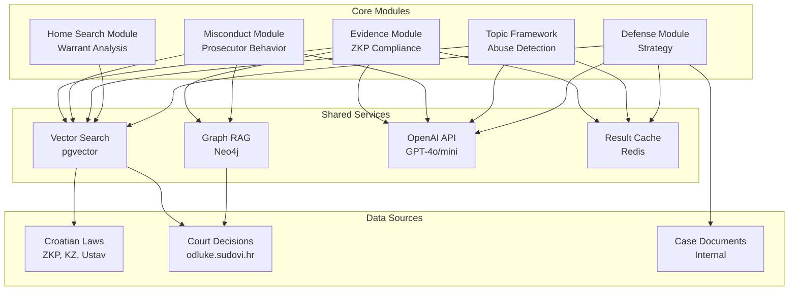
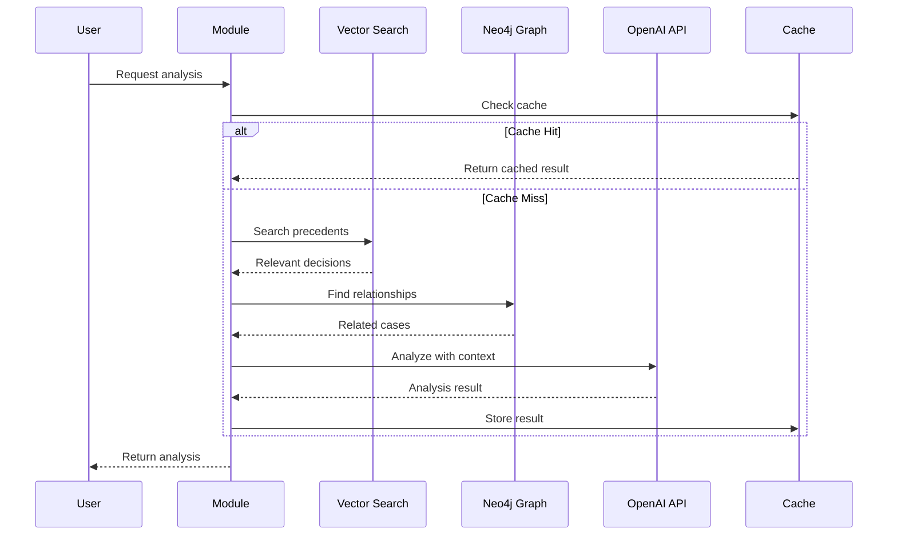

# Module Documentation Index

Welcome to the AI Legal War Machine module documentation. This system provides a comprehensive suite of AI-powered legal defense tools for Croatian criminal defense attorneys.

## Table of Contents

- [Module Overview](#module-overview)
- [Quick Start](#quick-start)
- [Module Details](#module-details)
- [Module Integration](#module-integration)
- [Best Practices](#best-practices)
- [Performance Considerations](#performance-considerations)

---

## Module Overview

The system is organized into **5 core modules**, each focused on a specific aspect of legal defense:

| Module | Purpose | Key Features | Status |
|--------|---------|--------------|--------|
| [Evidence](#evidence-module) | Evidence analysis & admissibility | ZKP compliance, constitutional violations, suppression motions | ✅ Production |
| [Misconduct](#misconduct-module) | Prosecutorial misconduct detection | 6 types of misconduct, dismissal motions, ethics complaints | ✅ Production |
| [Topic Framework](#topic-framework-module) | Modular abuse detection system | Drug charges, illegal searches, disproportionate sentencing | ✅ Production |
| [Home Search](#home-search-module) | Disproportionate warrant analysis | Proportionality violations, statistical analysis | ✅ Production |
| [Defense](#defense-module) | Strategy analysis & recommendations | Defense approach, precedent-based recommendations | ✅ Production |

### Module Architecture



---

## Quick Start

### Installation

All modules are included in the main Laravel application. No additional installation required.

### Basic Usage

```php
// Evidence Analysis
$evidenceModule = app(\App\Modules\Evidence\EvidenceAnalysisModule::class);
$result = $evidenceModule->analyzeEvidence($caseId, $evidenceData);

// Misconduct Detection
$misconductModule = app(\App\Modules\Misconduct\ProsecutorialMisconductModule::class);
$result = $misconductModule->analyzeMisconduct($caseId);

// Topic Analysis (Drug Charges)
$drugDetector = app(\App\Modules\Topics\Analyzers\DrugChargeAbuseDetector::class);
$result = $drugDetector->analyzeCase($caseId);

// Home Search Analysis
$homeSearchDetector = app(\App\Modules\HomeSearch\Services\HomeSearchAbuseDetector::class);
$result = $homeSearchDetector->detectAbuse($warrantData, $caseId);

// Defense Strategy
$defenseModule = app(\App\Modules\Defence\DefenceOnlyModule::class);
$result = $defenseModule->analyzeDefenseStrategy($caseId);
```

### API Endpoints

All modules expose REST API endpoints:

```bash
# Evidence Module
POST /api/evidence/analyze/{caseId}
POST /api/evidence/suppress-motion/{caseId}

# Misconduct Module
POST /api/misconduct/detect/{caseId}
POST /api/misconduct/dismissal-motion/{caseId}

# Topic Framework
POST /api/topics/drug-charges/{caseId}
POST /api/topics/illegal-searches/{caseId}

# Home Search Module
POST /api/home-search/analyze/{warrantId}

# Defense Module
POST /api/defense/strategy/{caseId}
```

---

## Module Details

### Evidence Module

**Location:** `app/Modules/Evidence/`
**Documentation:** [evidence/README.md](evidence/README.md)

#### Purpose
Comprehensive evidence analysis for Croatian criminal defense, focused on identifying legitimate grounds for challenging evidence admissibility.

#### Key Features
- **ZKP Compliance Check** - Verifies evidence meets Criminal Procedure Act requirements
- **Constitutional Violation Detection** - Identifies violations of Ustav RH (Croatian Constitution)
- **Alternative Interpretation Analysis** - Provides legitimate, fact-based alternative explanations
- **Suppression Motion Generation** - Creates formal "Prijedlog za isključenje dokaza" motions

#### Key Legal Authorities
- **ZKP (Zakon o kaznenom postupku)** - Criminal Procedure Act
  - Članak 9: Lawfulness of evidence collection
  - Članak 10: Prohibition of torture/coercion
  - Članak 11: Exclusion of illegal evidence
- **Ustav RH (Croatian Constitution)**
  - Članak 23: Prohibition of torture
  - Članak 29: Right to fair trial
  - Članak 34: Home inviolability
  - Članak 35: Privacy & communications

#### Services
1. `EvidenceAdmissibilityChecker` - ZKP compliance verification
2. `ConstitutionalViolationDetector` - Ustav RH violation detection
3. `AlternativeInterpretationAnalyzer` - Legitimate alternative explanations
4. `SuppressionMotionGenerator` - Croatian court motion generation

#### API Endpoints
- `POST /api/evidence/analyze/{caseId}` - Full evidence analysis
- `POST /api/evidence/suppress-motion/{caseId}` - Generate suppression motion
- `POST /api/evidence/check-admissibility/{caseId}` - Check ZKP compliance
- `POST /api/evidence/constitutional-violations/{caseId}` - Detect constitutional issues

#### Scoring System
**Excludability Score (0-100)**:
- 80-100: Highly challengeable (strong grounds)
- 60-79: Challengeable (moderate grounds)
- 40-59: Possibly challengeable (weak grounds)
- 0-39: Not challengeable

---

### Misconduct Module

**Location:** `app/Modules/Misconduct/`
**Documentation:** [misconduct/README.md](misconduct/README.md)

#### Purpose
Detect prosecutorial misconduct in Croatian criminal proceedings and generate appropriate legal responses.

#### Key Features
- **6 Types of Misconduct Detection** - Systematic identification of prosecutor violations
- **Severity Scoring (0-100)** - Quantifies misconduct impact
- **Dismissal Motion Generation** - Creates "Prijedlog za obustavu postupka"
- **Ethics Complaint Generation** - Creates complaints to Državnoodvjetničko vijeće
- **Pattern Analysis** - Identifies systematic misconduct patterns

#### Misconduct Types Detected

1. **Brady Violations** (Croatian equivalent)
   - Failure to disclose exculpatory evidence
   - Hiding favorable witness statements
   - Suppressing evidence of innocence
   - Legal Basis: ZKP Članak 9, Ustav RH Članak 29

2. **Selective Prosecution**
   - Discriminatory charging decisions
   - Targeting specific defendants
   - Inconsistent application of law
   - Legal Basis: Ustav RH Članak 14 (equality), Članak 29

3. **Evidence Fabrication**
   - Planting evidence
   - Falsifying reports
   - Coercing false testimony
   - Legal Basis: KZ Članak 305 (false testimony), ZKP Članak 11

4. **Witness Tampering**
   - Coaching witnesses
   - Threatening witnesses
   - Offering improper inducements
   - Legal Basis: KZ Članak 307, ZKP Članak 236

5. **Improper Conduct**
   - Inflammatory statements in court
   - Media prejudice
   - Improper argumentation
   - Legal Basis: ZKP Članak 20, Zakon o Državnom odvjetništvu

6. **Vindictive Prosecution**
   - Retaliatory charges
   - Escalation after rights exercise
   - Personal vendetta
   - Legal Basis: Ustav RH Članak 29

#### Services
1. `MisconductDetector` - Identifies 6 types of prosecutorial misconduct
2. `MisconductPatternAnalyzer` - Detects systematic patterns across cases
3. `DismissalMotionGenerator` - Generates "Prijedlog za obustavu postupka"
4. `ComplaintGenerator` - Creates ethics complaints
5. `AppealBuilder` - Builds appeals based on misconduct

#### API Endpoints
- `POST /api/misconduct/detect/{caseId}` - Detect all misconduct types
- `POST /api/misconduct/dismissal-motion/{caseId}` - Generate dismissal motion
- `POST /api/misconduct/complaint/{caseId}` - Generate ethics complaint
- `POST /api/misconduct/patterns` - Analyze patterns across cases

#### Severity Scoring
- **85-100**: Severe (dismissal likely)
- **70-84**: Serious (strong remedies)
- **50-69**: Moderate (sanctions/warnings)
- **<50**: Minor (noted but unlikely to change outcome)

---

### Topic Framework Module

**Location:** `app/Modules/Topics/`
**Documentation:** [topic-framework/README.md](topic-framework/README.md)

#### Purpose
Modular system for detecting systemic abuse patterns in Croatian criminal justice system.

#### Key Features
- **Modular Architecture** - Each topic is a standalone analyzer
- **Statistical Comparison** - Compares cases to regional/national averages
- **Pattern Detection** - Identifies systematic abuse
- **Extensible Design** - Easy to add new topics

#### Current Topics

1. **Drug Charge Abuse Detector**
   - Detects overcharging in drug cases
   - Compares to similar cases in region
   - Analyzes proportionality (amount vs. charge)
   - Legal Basis: KZ Članak 190-194 (drug offenses)

2. **Illegal Search Detector**
   - Identifies unconstitutional searches
   - Analyzes warrant validity
   - Detects pretextual stops
   - Legal Basis: Ustav RH Članak 34, 35

3. **Disproportionate Sentencing Detector**
   - Identifies excessive sentences
   - Compares to similar cases
   - Analyzes mitigating factors
   - Legal Basis: KZ Članak 45-52 (sentencing)

4. **Excessive Pretension Detector**
   - Detects over-detention before trial
   - Analyzes pretrial custody justification
   - Compares duration to case complexity
   - Legal Basis: ZKP Članak 123-132 (detention)

#### Architecture

```php
interface TopicAnalyzer
{
    // Analyze single case
    public function analyzeCase(int $caseId): array;

    // Get statistics for region
    public function getStatistics(?string $region = null): array;

    // Compare multiple regions
    public function compareRegions(array $regions): array;
}
```

#### API Endpoints
- `POST /api/topics/drug-charges/{caseId}` - Analyze drug charge abuse
- `POST /api/topics/illegal-searches/{caseId}` - Detect illegal searches
- `POST /api/topics/disproportionate-sentencing/{caseId}` - Analyze sentencing
- `POST /api/topics/excessive-pretension/{caseId}` - Analyze pretrial detention

#### Adding New Topics

1. Create analyzer: `app/Modules/Topics/Analyzers/NewTopicDetector.php`
2. Implement `TopicAnalyzer` interface
3. Add route in `routes/api.php`
4. Write tests: `tests/Unit/Topics/NewTopicDetectorTest.php`

---

### Home Search Module

**Location:** `app/Modules/HomeSearch/`
**Documentation:** [home-search/README.md](home-search/README.md)

#### Purpose
Detect disproportionate and unconstitutional home search warrants in Croatian criminal proceedings.

#### Key Features
- **Proportionality Analysis** - Measures crime severity vs. search scope
- **Statistical Comparison** - Compares to similar cases
- **Constitutional Compliance** - Verifies Ustav RH Članak 34 compliance
- **Court Decision Search** - Finds relevant precedents using vector search + Neo4j

#### Key Analysis Components

1. **Proportionality Analyzer**
   - Crime severity score (0-100)
   - Search scope score (0-100)
   - Proportionality ratio
   - Recommendation: proportional, disproportionate, severely disproportionate

2. **Statistical Analyzer**
   - Regional comparison (Osijek, Zagreb, Split, Rijeka)
   - National averages
   - Historical trends
   - Outlier detection

3. **Odluke Search Agent**
   - Vector similarity search for precedents
   - Neo4j graph traversal for related cases
   - Automatic citation extraction
   - Precedent strength scoring

#### Services
1. `HomeSearchAbuseDetector` - Main detection service
2. `ProportionalityAnalyzer` - Analyzes proportionality
3. `StatisticalAnalyzer` - Compares to statistical norms
4. `OdlukeSearchAgent` - Searches court decisions

#### API Endpoints
- `POST /api/home-search/analyze/{warrantId}` - Full warrant analysis
- `GET /api/home-search/statistics` - Get statistical data
- `POST /api/home-search/precedents` - Find similar precedents

#### Proportionality Thresholds
- **Ratio > 1.5** - Disproportionate (challengeable)
- **Ratio > 2.0** - Severely disproportionate (strong grounds for suppression)
- **Ratio ≤ 1.5** - Proportional

#### Legal Basis
- **Ustav RH Članak 34** - Home inviolability
- **ZKP Članak 214-223** - Search warrant requirements
- **ZKP Članak 9** - Proportionality principle

---

### Defense Module

**Location:** `app/Modules/Defence/`
**Documentation:** [defense/README.md](defense/README.md)

#### Purpose
Analyze defense strategies and provide recommendations based on precedents and case facts.

#### Key Features
- **Defense Strategy Analysis** - Evaluates current defense approach
- **Precedent-Based Recommendations** - Finds similar successful defenses
- **Accused Status Improvement** - Suggests ways to improve defendant's position
- **Multi-Factor Analysis** - Considers evidence, procedure, precedents

#### Services
1. `DefenseStrategyAnalyzer` - Analyzes current defense approach
2. `DefenseRecommendationService` - Provides strategic recommendations
3. `ImproveAccusedStatusAction` - Suggests improvements to defendant position

#### Analysis Components

1. **Current Strategy Assessment**
   - Strengths of current approach
   - Weaknesses and gaps
   - Risk factors
   - Success probability

2. **Alternative Strategies**
   - Factual defense approaches
   - Legal defense options
   - Procedural challenges
   - Ranked by success probability

3. **Precedent Analysis**
   - Similar successful cases
   - Key arguments used
   - Court reasoning
   - Applicability to current case

4. **Accused Status Improvement**
   - Bond/bail recommendations
   - Pretrial release arguments
   - Conditions modification
   - Status upgrade pathways

#### API Endpoints
- `POST /api/defense/strategy/{caseId}` - Analyze defense strategy
- `POST /api/defense/recommendations/{caseId}` - Get strategic recommendations
- `POST /api/defense/improve-status/{caseId}` - Accused status improvements

#### Recommendation Scoring
- **Confidence (0-100)** - How confident the recommendation is
- **Applicability (0-100)** - How applicable to current case
- **Success Probability (0-100)** - Estimated success rate
- **Risk Level (low/medium/high)** - Potential downsides

---

## Module Integration

### How Modules Work Together

Modules are designed to work independently but can be orchestrated together for comprehensive case analysis:

```php
// Comprehensive Case Analysis
$caseId = 123;

// 1. Evidence Analysis
$evidenceModule = app(\App\Modules\Evidence\EvidenceAnalysisModule::class);
$evidenceResult = $evidenceModule->analyzeEvidence($caseId, $evidenceData);

// 2. If evidence issues found, check for misconduct
if ($evidenceResult['highly_challengeable'] > 0) {
    $misconductModule = app(\App\Modules\Misconduct\ProsecutorialMisconductModule::class);
    $misconductResult = $misconductModule->analyzeMisconduct($caseId);
}

// 3. Check for systemic abuse patterns
$drugDetector = app(\App\Modules\Topics\Analyzers\DrugChargeAbuseDetector::class);
$abuseResult = $drugDetector->analyzeCase($caseId);

// 4. Get defense strategy recommendations
$defenseModule = app(\App\Modules\Defence\DefenceOnlyModule::class);
$strategyResult = $defenseModule->analyzeDefenseStrategy($caseId);

// 5. Generate motions based on findings
if ($evidenceResult['excludability_score'] > 80) {
    $suppressionMotion = $evidenceModule->generateSuppressionMotion($caseId, $evidenceIds);
}

if ($misconductResult['severity_score'] > 85) {
    $dismissalMotion = $misconductModule->generateDismissalMotion($caseId);
}
```

### Shared Services

All modules leverage shared services:

1. **Vector Search (pgvector)**
   - Court decision search
   - Law article search
   - Case document search
   - Services: `CourtDecisionVectorStoreService`, `LawVectorStoreService`

2. **Graph RAG (Neo4j)**
   - Relationship traversal (CITES, REFERENCES)
   - Citation networks
   - Legal concept graphs
   - Services: Graph client via `config/neo4j.php`

3. **LLM Integration (OpenAI)**
   - GPT-4o for complex analysis
   - GPT-4o-mini for simple tasks
   - Embeddings: text-embedding-3-small
   - Services: OpenAI client via `config/openai.php`

4. **Result Caching (Redis)**
   - Agent result caching
   - Query result caching
   - TTL-based expiration
   - Services: `AgentResultCacheService`

### Data Flow



---

## Best Practices

### 1. Module Selection

Choose modules based on case characteristics:

| Case Type | Recommended Modules | Priority |
|-----------|-------------------|----------|
| Drug charges with search | Evidence → Topics (Drug) → Home Search → Defense | High |
| Confession-based case | Evidence → Misconduct → Defense | High |
| Weak evidence case | Evidence → Defense | Medium |
| Excessive sentence | Topics (Sentencing) → Defense | Medium |
| Prosecutorial issues | Misconduct → Evidence | High |

### 2. Error Handling

All modules return consistent error structures:

```php
try {
    $result = $module->analyze($caseId);

    if (!$result['success']) {
        Log::error('Module analysis failed', [
            'case_id' => $caseId,
            'error' => $result['error'],
        ]);
    }
} catch (\Exception $e) {
    Log::error('Module exception', [
        'case_id' => $caseId,
        'exception' => $e->getMessage(),
    ]);
}
```

### 3. Performance Optimization

Use caching and parallel execution:

```php
use App\Services\AgentResultCacheService;
use App\Services\ParallelExecutionService;

$cache = app(AgentResultCacheService::class);
$parallel = app(ParallelExecutionService::class);

// Generate cache key
$cacheKey = $cache->generateCacheKey("case_{$caseId}", ['module' => 'evidence']);

// Check cache first
$result = $cache->remember('evidence', $cacheKey, function() use ($module, $caseId) {
    return $module->analyzeEvidence($caseId, $evidenceData);
}, ttl: 3600);

// Or execute multiple modules in parallel
$tasks = [
    'evidence' => fn() => $evidenceModule->analyzeEvidence($caseId, $data),
    'misconduct' => fn() => $misconductModule->analyzeMisconduct($caseId),
    'drug_abuse' => fn() => $drugDetector->analyzeCase($caseId),
];

$results = $parallel->execute($tasks, maxParallel: 3);
```

### 4. Testing Modules

All modules should be tested with offline mocks:

```php
use Illuminate\Support\Facades\Http;
use Tests\Concerns\UsesTestDatabase;

class ModuleTest extends TestCase
{
    use UsesTestDatabase;

    protected function setUp(): void
    {
        parent::setUp();

        // Mock OpenAI API
        Http::fake([
            'api.openai.com/v1/embeddings' => Http::response([
                'data' => [['embedding' => array_fill(0, 1536, 0.1)]],
            ], 200),
            'api.openai.com/v1/chat/completions' => Http::response([
                'choices' => [['message' => ['content' => 'Test analysis']]],
            ], 200),
        ]);
    }

    public function test_module_analysis()
    {
        $module = app(\App\Modules\Evidence\EvidenceAnalysisModule::class);
        $result = $module->analyzeEvidence($this->caseId, $this->evidenceData);

        $this->assertTrue($result['success']);
        $this->assertArrayHasKey('evidence_analysis', $result['data']);
    }
}
```

### 5. Logging and Monitoring

Enable comprehensive logging:

```php
// In module code
Log::info('Module analysis started', [
    'module' => 'evidence',
    'case_id' => $caseId,
]);

$startTime = microtime(true);

// ... analysis ...

$duration = (microtime(true) - $startTime) * 1000;

Log::info('Module analysis completed', [
    'module' => 'evidence',
    'case_id' => $caseId,
    'duration_ms' => round($duration, 2),
    'items_analyzed' => count($evidenceData),
]);
```

---

## Performance Considerations

### Expected Performance Targets

| Module | Target Time | Actual (Optimized) | Notes |
|--------|-------------|-------------------|-------|
| Evidence Analysis | <5s | ~3-4s | Depends on evidence count |
| Misconduct Detection | <8s | ~5-7s | Includes pattern analysis |
| Topic Analyzers | <5s | ~3-5s | Per topic |
| Home Search | <10s | ~7-9s | Includes precedent search |
| Defense Strategy | <8s | ~6-8s | Includes precedent search |

### Optimization Strategies

1. **Database Indexes** - All modules benefit from performance indexes:
   ```bash
   php artisan migrate  # Runs 2025_11_11_013500_add_performance_indexes
   ```

2. **Result Caching** - Cache module results:
   ```php
   $cache = app(\App\Services\AgentResultCacheService::class);
   $result = $cache->remember('module_type', $cacheKey, $executor, ttl: 3600);
   ```

3. **Parallel Execution** - Execute independent modules concurrently:
   ```php
   $parallel = app(\App\Services\ParallelExecutionService::class);
   $results = $parallel->execute($tasks, maxParallel: 3);
   ```

4. **IVFFlat Vector Indexes** - Optimize vector searches:
   ```sql
   -- Already created by migration
   -- 10-50x improvement for similarity searches
   ```

5. **LLM Optimization**:
   - Use `gpt-4o-mini` for simple tasks (15x cheaper, 5x faster)
   - Batch multiple items in single API call
   - Implement streaming for long responses

### Monitoring Module Performance

```bash
# Profile module performance
php artisan agents:profile all --runs=5

# Check slow queries
# In .env: DB_LOG_QUERIES=true
php artisan pail --filter="Query took"

# Monitor cache hit rate
php artisan tinker
>>> app(\App\Services\AgentResultCacheService::class)->getStats();
```

---

## Module Development Guidelines

### Creating a New Module

1. **Create module directory structure**:
   ```
   app/Modules/NewModule/
   ├── NewModuleMain.php
   ├── Services/
   │   ├── AnalysisService.php
   │   └── GenerationService.php
   └── Models/
       └── ModuleData.php
   ```

2. **Implement module interface**:
   ```php
   namespace App\Modules\NewModule;

   class NewModuleMain
   {
       public function analyze(int $caseId, array $data): array
       {
           return [
               'success' => true,
               'data' => [
                   // Analysis results
               ],
           ];
       }
   }
   ```

3. **Add API routes**:
   ```php
   // routes/api.php
   Route::prefix('new-module')->group(function () {
       Route::post('/analyze/{caseId}', [NewModuleController::class, 'analyze']);
   });
   ```

4. **Write tests**:
   ```php
   // tests/Unit/Modules/NewModuleTest.php
   class NewModuleTest extends TestCase
   {
       use UsesTestDatabase;

       public function test_module_analysis()
       {
           // Test implementation
       }
   }
   ```

5. **Create documentation**:
   ```
   docs/modules/new-module/
   ├── README.md
   └── examples.md
   ```

6. **Update this index**:
   - Add module to overview table
   - Add detailed section
   - Update integration examples

---

## Troubleshooting

### Common Issues

1. **Module returns empty results**
   - Check vector store has data: `DB::table('court_decision_embeddings')->count()`
   - Verify OpenAI API key: `cat .env | grep OPENAI_API_KEY`
   - Check logs: `tail -f storage/logs/laravel.log`

2. **Module analysis too slow**
   - Profile performance: `php artisan agents:profile all`
   - Check database indexes: See [PERFORMANCE_OPTIMIZATION.md](../PERFORMANCE_OPTIMIZATION.md)
   - Enable caching: Use `AgentResultCacheService`

3. **OpenAI API errors**
   - Rate limits: Reduce parallel calls
   - Context length: Chunk large inputs
   - Cost concerns: Use `gpt-4o-mini` for simple tasks

For detailed troubleshooting, see [TROUBLESHOOTING.md](../TROUBLESHOOTING.md).

---

## Resources

- **Main Documentation**: [README.md](../../README.md)
- **Architecture**: [ARCHITECTURE.md](../ARCHITECTURE.md)
- **Testing Guide**: [TESTING.md](../../TESTING.md)
- **Performance Guide**: [PERFORMANCE_OPTIMIZATION.md](../PERFORMANCE_OPTIMIZATION.md)
- **Troubleshooting**: [TROUBLESHOOTING.md](../TROUBLESHOOTING.md)
- **API Documentation**: [API_DOCUMENTATION.md](../../API_DOCUMENTATION.md)

### Individual Module Docs

- [Evidence Module](evidence/README.md)
- [Misconduct Module](misconduct/README.md)
- [Topic Framework](topic-framework/README.md)
- [Home Search Module](home-search/README.md)
- [Defense Module](defense/README.md)

---

## Changelog

### Version 1.1.0 (2025-11-11)
- Added comprehensive module index documentation
- Updated all module documentation with performance targets
- Added integration examples and best practices
- Created module architecture diagrams

### Version 1.0.0 (2025-10-28)
- Initial release with 5 core modules
- Evidence, Misconduct, Topics, Home Search, Defense
- Full Croatian legal system integration
- Vector + Graph hybrid search
- OpenAI GPT-4o/mini integration

---

## Legal Disclaimer

All modules provide **analysis tools** for defense attorneys. They do NOT:
- Provide legal advice
- Guarantee case outcomes
- Replace qualified legal counsel
- Authorize unethical practices

Always consult with a licensed Croatian attorney before using analysis results in actual legal proceedings.

---

## Support

For module-specific issues:
1. Check individual module documentation
2. Review [TROUBLESHOOTING.md](../TROUBLESHOOTING.md)
3. Check system logs: `storage/logs/laravel.log`
4. Run diagnostics: `php artisan agents:profile all`

For general system issues, see [Getting Help](../TROUBLESHOOTING.md#getting-help).
