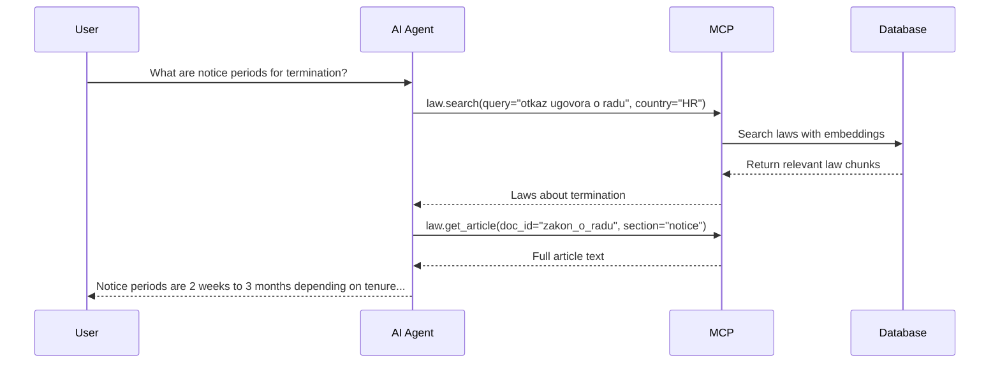
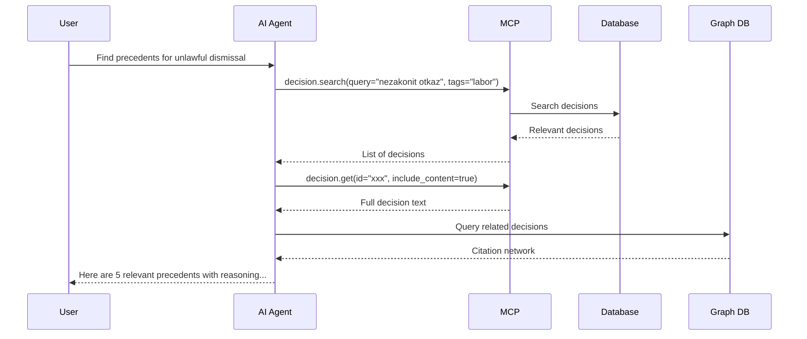
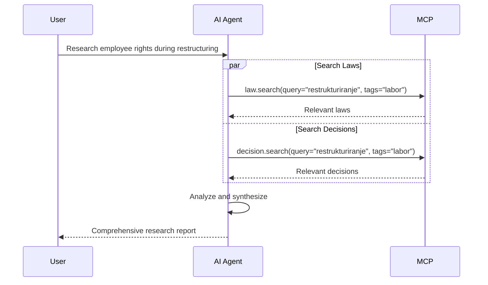
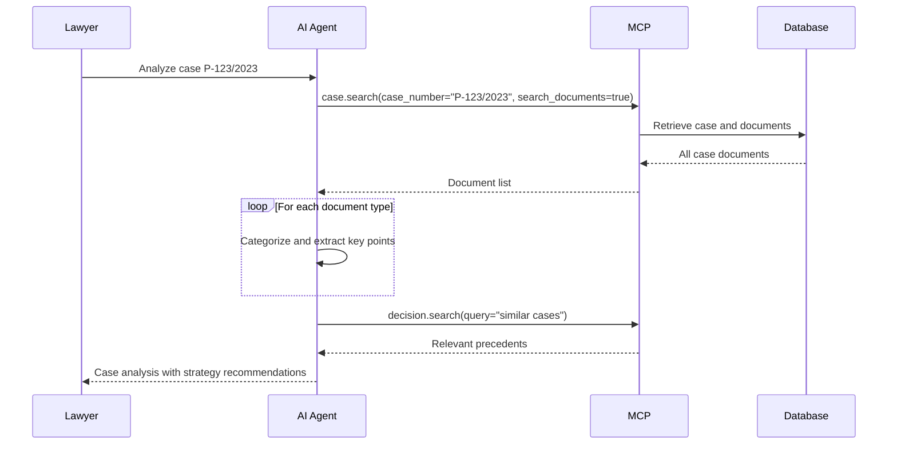

# RAG (Retrieval-Augmented Generation) Guide

## Overview

This guide explains how to use the Legal Database MCP Server for Retrieval-Augmented Generation (RAG) applications. RAG combines the power of large language models with external knowledge retrieval to provide accurate, contextual, and up-to-date legal information.

## System Architecture

The legal database system implements a multi-layered RAG architecture:

```
┌─────────────────────────────────────────────────────────────┐
│                    AI Agent / LLM Client                     │
└──────────────────────┬──────────────────────────────────────┘
                       │ MCP Protocol
┌──────────────────────▼──────────────────────────────────────┐
│              Legal Database MCP Server                       │
│  ┌────────────┐  ┌──────────────┐  ┌───────────────┐       │
│  │ Law Tools  │  │ Decision     │  │ Case Tools    │       │
│  │            │  │ Tools        │  │ (Private)     │       │
│  └─────┬──────┘  └──────┬───────┘  └───────┬───────┘       │
└────────┼────────────────┼──────────────────┼────────────────┘
         │                │                  │
┌────────▼────────────────▼──────────────────▼────────────────┐
│              PostgreSQL + pgvector                           │
│  ┌──────────────┐  ┌──────────────┐  ┌──────────────┐      │
│  │ Laws         │  │ Court        │  │ Legal Cases  │      │
│  │ (chunked)    │  │ Decisions    │  │ (chunked)    │      │
│  │ + embeddings │  │ + embeddings │  │ + embeddings │      │
│  └──────────────┘  └──────────────┘  └──────────────┘      │
└──────────────────────────────────────────────────────────────┘
         │                │                  │
┌────────▼────────────────▼──────────────────▼────────────────┐
│                    Neo4j Graph Database                      │
│         (Relationships, Citations, References)               │
└──────────────────────────────────────────────────────────────┘
```

## Data Model

### 1. Laws

Laws are stored as chunked documents with semantic embeddings:

- **Chunking**: Large laws are split into manageable chunks (articles, sections)
- **Embeddings**: Each chunk has a 1536-dimension vector (OpenAI ada-002)
- **Metadata**: Jurisdiction, country, language, dates, tags
- **Graph**: Laws are connected to related laws, amendments, and decisions

### 2. Court Decisions

Court decisions include metadata and full-text content:

- **Metadata**: Case number, court, judges, dates, ECLI
- **Documents**: Decisions can have multiple document chunks
- **Citations**: Extracted and linked in Neo4j graph
- **Embeddings**: Semantic search across decision content

### 3. Legal Cases (Private)

Internal case management with rich document support:

- **Case Information**: Parties, court, status, timeline
- **Documents**: All case-related documents (complaints, motions, evidence)
- **Relationships**: Links to relevant court decisions and laws

## RAG Workflows

### Workflow 1: Legal Question Answering

**Use Case**: Answer specific legal questions using Croatian law.

**Example**: "What are the notice periods for employment termination in Croatia?"



**Implementation**:

1. **Initial Search**: Use `law.search` to find relevant laws
2. **Retrieve Details**: Use `law.get_article` to get full article text
3. **Contextualize**: AI synthesizes answer from retrieved content
4. **Cite Sources**: Include law numbers and article references

### Workflow 2: Case Precedent Research

**Use Case**: Find relevant court precedents for a legal argument.

**Example**: "Find decisions about unlawful dismissal in labor disputes."



**Implementation**:

1. **Broad Search**: Use `decision.search` with filters
2. **Retrieve Key Decisions**: Get full text of most relevant decisions
3. **Explore Graph**: Find cited and citing decisions
4. **Rank & Summarize**: Present most relevant precedents

### Workflow 3: Multi-Source Legal Research

**Use Case**: Comprehensive legal research combining laws and decisions.

**Example**: "Research employee rights during company restructuring in Croatia."



**Implementation**:

1. **Parallel Search**: Query laws and decisions simultaneously
2. **Cross-Reference**: Identify which decisions cite which laws
3. **Temporal Analysis**: Track changes in interpretation over time
4. **Synthesis**: Create comprehensive answer with multiple sources

### Workflow 4: Case Document Analysis (Private)

**Use Case**: Analyze case files to prepare legal strategy.

**Example**: "Review all documents in case P-123/2023 and identify key arguments."



**Implementation**:

1. **Retrieve Case**: Get all documents for the case
2. **Categorize**: Organize by document type (complaint, evidence, motions)
3. **Extract**: Identify key facts, arguments, legal issues
4. **Find Precedents**: Search for similar cases and decisions
5. **Strategy**: Suggest legal arguments based on precedents

## Embedding and Semantic Search

### How Embeddings Work

The system uses OpenAI's text-embedding-ada-002 model to create semantic representations:

1. **Text Chunking**: Documents are split into ~500-1000 token chunks
2. **Embedding Generation**: Each chunk → 1536-dimensional vector
3. **Storage**: Vectors stored in PostgreSQL using pgvector extension
4. **Indexing**: IVFFlat index for fast similarity search

### Search Strategies

**Keyword Search** (Fast, exact matching):
```javascript
{
  "tool": "law.search",
  "arguments": {
    "query": "otkaz ugovora o radu",
    "law_number": "93/14"
  }
}
```

**Semantic Search** (Slower, finds conceptually similar):
- Handled internally by the vector store
- Automatically ranks by semantic similarity
- Works across paraphrases and synonyms

**Hybrid Search** (Best results):
- Combine keyword filters with semantic ranking
- Use metadata filters to narrow scope
- Let embeddings handle semantic matching

### Best Practices for RAG Queries

1. **Start Broad, Then Narrow**:
   - First query: Get overview with broader search
   - Second query: Retrieve specific details

2. **Use Filters**:
   - Jurisdiction, country, language to reduce noise
   - Date ranges for temporal relevance
   - Tags for categorical filtering

3. **Pagination for Exploration**:
   - Start with `limit=10` to get top results
   - Increase if more context needed
   - Don't fetch all results unless necessary

4. **Content Selection**:
   - Set `include_content=false` for metadata-only
   - Use `include_content=true` when full text is needed
   - Balance between context and token usage

## Graph Database Integration

The system uses Neo4j to store relationships between legal documents:

### Graph Schema

```cypher
// Nodes
(Law {id, doc_id, title, law_number})
(CourtDecision {id, case_number, court})
(CaseDocument {id, case_id, title})

// Relationships
(Law)-[:AMENDS]->(Law)
(Law)-[:REPEALS]->(Law)
(CourtDecision)-[:CITES]->(Law)
(CourtDecision)-[:REFERENCES]->(CourtDecision)
(CaseDocument)-[:RELATES_TO]->(Law)
(CaseDocument)-[:SUPPORTS]->(CaseDocument)
```

### Using Graph for RAG

**Find Citation Network**:
```cypher
// Find all decisions that cite a specific law
MATCH (d:CourtDecision)-[:CITES]->(l:Law {doc_id: 'nn_93_2014'})
RETURN d
```

**Discover Related Laws**:
```cypher
// Find laws related through decisions
MATCH (l1:Law {doc_id: 'nn_93_2014'})<-[:CITES]-(d:CourtDecision)-[:CITES]->(l2:Law)
WHERE l1 <> l2
RETURN DISTINCT l2, count(d) as citations
ORDER BY citations DESC
```

**Temporal Analysis**:
```cypher
// Track how a law's interpretation evolved
MATCH (l:Law {doc_id: 'nn_93_2014'})<-[:CITES]-(d:CourtDecision)
RETURN d.decision_date, d.title, d.case_number
ORDER BY d.decision_date
```

## Advanced RAG Techniques

### 1. Iterative Refinement

Start with broad search, then refine based on results:

```python
# Step 1: Initial broad search
laws = search_laws(query="employment contracts", limit=20)

# Step 2: Analyze results, extract key concepts
key_concepts = extract_concepts(laws)  # AI extracts: "termination", "notice", "severance"

# Step 3: Refined search with concepts
detailed_laws = []
for concept in key_concepts:
    detailed = search_laws(query=concept, limit=5)
    detailed_laws.extend(detailed)

# Step 4: Get full articles
full_articles = [get_article(law['doc_id']) for law in detailed_laws]
```

### 2. Multi-Hop Reasoning

Follow references and citations:

```python
# Find law about topic
law = search_laws(query="minimum wage")[0]

# Find decisions that cite this law
decisions = search_decisions(query=law['law_number'])

# Find other laws cited in those decisions
related_laws = []
for decision in decisions:
    decision_full = get_decision(decision['id'], include_content=True)
    # Extract cited laws from content
    cited_laws = extract_citations(decision_full)
    related_laws.extend(cited_laws)
```

### 3. Temporal Context

Consider when laws and decisions were enacted:

```python
# Find current version of law
current_law = search_laws(
    law_number="93/14",
    repeal_date=None  # Not repealed
)[0]

# Find historical decisions
old_decisions = search_decisions(
    query="labor contract",
    date_from="2000-01-01",
    date_to="2014-07-01"  # Before current law
)

# Find recent decisions under current law
recent_decisions = search_decisions(
    query="labor contract",
    date_from="2014-07-01"  # After current law took effect
)
```

### 4. Cross-Lingual RAG

Support queries in multiple languages:

```python
# User asks in English
question = "What are employee rights in Croatia?"

# Search in Croatian (primary language)
laws_hr = search_laws(
    query="prava radnika",  # Translated query
    country="HR",
    language="hr"
)

# AI can answer in English using Croatian sources
answer = generate_answer(
    question=question,
    context=laws_hr,
    answer_language="en"
)
```

## Performance Optimization

### Caching Strategy

Cache frequently accessed documents:

```python
from functools import lru_cache

@lru_cache(maxsize=1000)
def get_law_cached(doc_id: str):
    return get_article(doc_id)

@lru_cache(maxsize=500)
def get_decision_cached(decision_id: str):
    return get_decision(decision_id, include_content=True)
```

### Batch Operations

Process multiple queries in parallel:

```python
from concurrent.futures import ThreadPoolExecutor

def search_all_sources(query: str):
    with ThreadPoolExecutor(max_workers=3) as executor:
        laws_future = executor.submit(search_laws, query=query)
        decisions_future = executor.submit(search_decisions, query=query)

        laws = laws_future.result()
        decisions = decisions_future.result()

    return {"laws": laws, "decisions": decisions}
```

### Token Management

Optimize token usage for large contexts:

```python
def smart_retrieve(query: str, max_tokens: int = 4000):
    # Get candidates
    laws = search_laws(query=query, limit=50)

    # Rank by relevance (using embeddings)
    ranked = rank_by_similarity(query, laws)

    # Add until token budget exhausted
    context = []
    token_count = 0

    for law in ranked:
        article = get_article(law['doc_id'])
        article_tokens = count_tokens(article)

        if token_count + article_tokens <= max_tokens:
            context.append(article)
            token_count += article_tokens
        else:
            break

    return context
```

## Example Use Cases

### 1. Legal Chatbot

```python
def legal_chatbot(user_question: str) -> str:
    # Search for relevant sources
    laws = search_laws(query=user_question, limit=5)
    decisions = search_decisions(query=user_question, limit=5)

    # Build context
    context = []
    for law in laws:
        articles = get_article(law['doc_id'])
        context.append(f"Law {law['law_number']}: {articles}")

    for decision in decisions:
        dec = get_decision(decision['id'], include_content=False)
        context.append(f"Decision {dec['case_number']}: {dec['description']}")

    # Generate answer with LLM
    prompt = f"""Based on Croatian law, answer this question:

    Question: {user_question}

    Legal Sources:
    {chr(10).join(context)}

    Provide a clear answer with citations."""

    return generate_completion(prompt)
```

### 2. Contract Review Assistant

```python
def review_contract(contract_text: str, contract_type: str) -> dict:
    # Find relevant laws
    laws = search_laws(
        query=f"{contract_type} contract requirements",
        country="HR",
        tags="contracts,obligations"
    )

    # Find relevant precedents
    decisions = search_decisions(
        query=f"{contract_type} contract disputes",
        tags="contracts"
    )

    # Analyze contract against legal requirements
    analysis = analyze_with_llm(
        contract=contract_text,
        laws=[get_article(l['doc_id']) for l in laws],
        precedents=[get_decision(d['id']) for d in decisions]
    )

    return {
        "compliance_issues": analysis['issues'],
        "recommendations": analysis['recommendations'],
        "relevant_laws": laws,
        "precedents": decisions
    }
```

### 3. Legal Research Automation

```python
def research_topic(topic: str, depth: str = "comprehensive") -> dict:
    results = {
        "laws": [],
        "decisions": [],
        "analysis": {},
        "citations": []
    }

    # Phase 1: Primary sources
    results["laws"] = search_laws(query=topic, limit=20)
    results["decisions"] = search_decisions(query=topic, limit=20)

    if depth == "comprehensive":
        # Phase 2: Follow citations
        for decision in results["decisions"]:
            full_dec = get_decision(decision['id'], include_content=True)
            citations = extract_citations_from_text(full_dec)
            results["citations"].extend(citations)

        # Phase 3: Cross-reference
        for citation in results["citations"]:
            cited_law = search_laws(law_number=citation)
            if cited_law not in results["laws"]:
                results["laws"].extend(cited_law)

    # Phase 4: Synthesize
    results["analysis"] = synthesize_research(results)

    return results
```

## Integration with AI Agents

### Claude with MCP

```python
import anthropic

client = anthropic.Anthropic()

# Define MCP tools
tools = [
    {
        "name": "law.search",
        "description": "Search Croatian laws",
        "input_schema": {
            "type": "object",
            "properties": {
                "query": {"type": "string"},
                "country": {"type": "string"},
                "limit": {"type": "integer"}
            },
            "required": ["query"]
        }
    },
    # ... other tools
]

# Use in conversation
response = client.messages.create(
    model="claude-3-5-sonnet-20241022",
    max_tokens=4096,
    tools=tools,
    messages=[
        {
            "role": "user",
            "content": "What are the rules for overtime pay in Croatia?"
        }
    ]
)
```

### OpenAI Function Calling

```python
import openai

client = openai.OpenAI()

response = client.chat.completions.create(
    model="gpt-4",
    messages=[
        {"role": "user", "content": "Find laws about data protection in Croatia"}
    ],
    functions=[
        {
            "name": "law.search",
            "description": "Search Croatian laws",
            "parameters": {
                "type": "object",
                "properties": {
                    "query": {"type": "string"},
                    "country": {"type": "string"}
                }
            }
        }
    ],
    function_call="auto"
)
```

## Monitoring and Analytics

Track RAG system performance:

1. **Query Metrics**: Track which queries are most common
2. **Retrieval Quality**: Measure relevance of retrieved documents
3. **Response Time**: Monitor search and retrieval latency
4. **Cache Hit Rate**: Optimize caching based on access patterns
5. **Token Usage**: Track token consumption per query

## Security Considerations

1. **Authentication**: Use API tokens for MCP access
2. **Rate Limiting**: Prevent abuse with per-tool limits
3. **Data Access**: Case data requires authentication (private tools)
4. **Audit Logging**: Log all search queries for compliance
5. **Data Sanitization**: Validate and sanitize all user inputs

## Best Practices Summary

1. ✅ **Use specific filters** to narrow search scope
2. ✅ **Start with metadata** before fetching full content
3. ✅ **Cache frequently accessed** documents
4. ✅ **Paginate large result** sets
5. ✅ **Combine keyword and semantic** search
6. ✅ **Follow citation graphs** for comprehensive research
7. ✅ **Consider temporal context** (law effective dates, decision dates)
8. ✅ **Batch parallel queries** when possible
9. ✅ **Monitor token usage** to stay within LLM context limits
10. ✅ **Cite sources** in generated responses

## Further Reading

- [MCP Tools Documentation](MCP_TOOLS.md) - Detailed API reference
- [Graph Database Implementation](GRAPH_IMPLEMENTATION_SUMMARY.md) - Neo4j integration
- [OpenAI Embeddings Guide](https://platform.openai.com/docs/guides/embeddings)
- [pgvector Documentation](https://github.com/pgvector/pgvector)

## Support

For questions about RAG implementation or optimization, contact the development team or refer to the project documentation.
