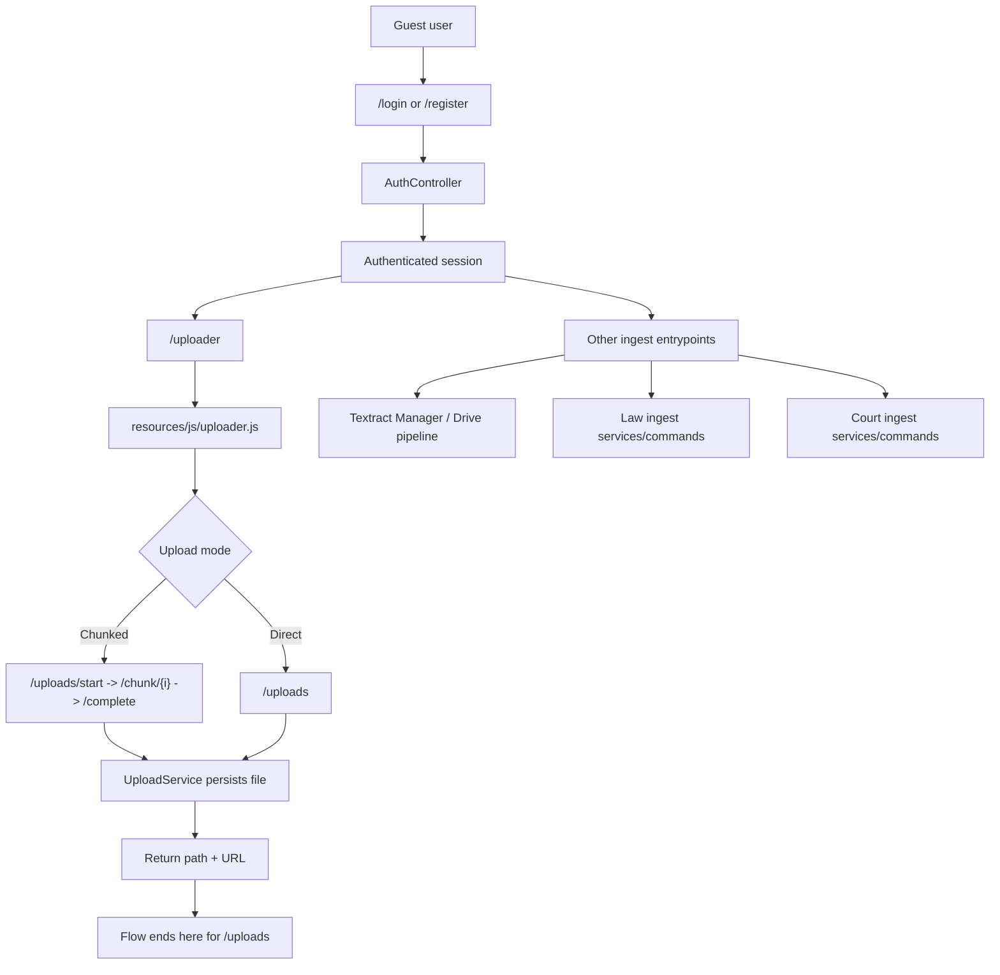

# 01 - Auth, Uploader, and Ingest Entrypoints

## 0. Mermaid Flow Diagram

## 1. Authentication Flow

### Routes

- `GET /login` -> `AuthController@showLogin` (`guest`): `routes/web.php`
- `POST /login` -> `AuthController@login` (`guest`): `routes/web.php`
- `GET /register` -> `AuthController@showRegister` (`guest`): `routes/web.php`
- `POST /register` -> `AuthController@register` (`guest`): `routes/web.php`
- `POST /logout` -> `AuthController@logout` (`auth`): `routes/web.php`

### Controller behavior

- `AuthController@login` validates via `LoginRequest`, attempts auth, regenerates session, redirects to `/dashboard`: `app/Http/Controllers/AuthController.php`
- `AuthController@register` validates via `RegisterRequest`, creates user, logs in, redirects: `app/Http/Controllers/AuthController.php`
- `AuthController@logout` invalidates session + CSRF token: `app/Http/Controllers/AuthController.php`

## 2. `/uploader` Flow (Web)

### UI entry

- Protected page: `GET /uploader` -> `resources/views/uploader.blade.php`: `routes/web.php`
- Frontend uploader logic: `resources/js/uploader.js`

### Upload endpoints used by frontend

- `POST /uploads/start`
- `POST /uploads/{uploadId}/chunk/{index}`
- `POST /uploads/{uploadId}/complete`
- Optional direct: `POST /uploads/`

Defined in `routes/web.php` (session-auth) and mirrored in `routes/api.php` (`api.token`).

## 3. Upload Controller and Service Truth

### Controller

- `direct()` -> `UploadService::directStore()`: `app/Http/Controllers/UploadController.php`
- `start()` -> `UploadService::start()`
- `chunk()` -> `UploadService::uploadChunk()`
- `complete()` -> `UploadService::complete()`
- `cancel()` -> `UploadService::cancel()`

### Service behavior

- Manifest + chunk storage under `uploads/manifests` and `uploads/chunks`: `app/Services/UploadService.php`
- Chunk assembly to `tmp/uploads/{id}.part`, final write to public disk under `uploads/...`
- Returns URL/path/metadata for uploaded file

## 4. Critical Truth: `/uploads` Does Not Trigger OCR/Embedding/Analysis

No queued analysis jobs are dispatched by `UploadController` or `UploadService` after successful upload completion.

Implication:

- Login -> `/uploader` -> upload currently ends with persisted file + URL.
- It does **not** automatically invoke Textract/Tesseract, embeddings, graph sync, or case analysis.

Relevant files:

- `app/Http/Controllers/UploadController.php`
- `app/Services/UploadService.php`

## 5. Where "real" downstream pipelines start today

Post-upload style processing exists, but through **other entrypoints**:

- Textract Manager / Google Drive ingestion: `app/Http/Livewire/TextractManager.php`
- Odluke/USUD/ESLJP/Informator ingestion services/commands
- Law ingestion commands/services
