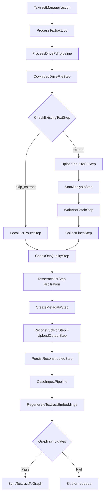

# 02 - Google Drive OCR -> Embedding -> Graph Pipeline

## 0. Mermaid Flow Diagram

## 1. Entry Paths

### A. Sync from Drive folder

- Livewire action `syncFromDrive()` lists PDFs in configured Drive folder and creates/upserts `TextractJob` rows:
  - `app/Http/Livewire/TextractManager.php`
  - `app/Actions/Textract/ListDrivePdfs.php`
  - `app/Services/GoogleDriveService.php`

### B. Process specific job

- `processJob()` dispatches `ProcessTextractJob`: `app/Http/Livewire/TextractManager.php`
- Job invokes `ProcessDrivePdf`: `app/Jobs/ProcessTextractJob.php`

### C. Manual Drive file input

- `processManual()` dispatches `ProcessDrivePdf` with Drive file id/name: `app/Http/Livewire/TextractManager.php`

## 2. Pipeline Steps (`ProcessDrivePdf`)

Executed in `app/Actions/Textract/ProcessDrivePdf.php`:

1. `EnsureJobStep`
2. `DownloadDriveFileStep`
3. `CheckExistingTextStep`
4. `LocalOcrRouteStep`
5. `UploadInputToS3Step`
6. `StartAnalysisStep`
7. `WaitAndFetchStep`
8. `SaveResultsStep`
9. `CollectLinesStep`
10. `CheckOcrQualityStep`
11. `TesseractOcrStep`
12. `CreateMetadataStep`
13. `ReconstructPdfStep`
14. `UploadOutputStep`
15. `PersistReconstructedStep`

## 3. OCR Routing Model

### Fast path (already searchable PDF)

- `CheckExistingTextStep` can set `skip_textract`.
- `LocalOcrRouteStep` applies `ocrmypdf --skip-text` style flow and extracts text without full Textract call.

### Textract path

- Upload to S3, start async analysis, wait/fetch blocks, save raw output, build line/doc structures.

### Tesseract arbitration path

- `TesseractOcrStep` uses `DocumentOcrRouter`, local availability checks, and quality comparison (`OcrQualityComparator`) to keep best result (Textract vs local OCR).

Key files:

- `app/Pipelines/Textract/CheckExistingTextStep.php`
- `app/Pipelines/Textract/LocalOcrRouteStep.php`
- `app/Pipelines/Textract/StartAnalysisStep.php`
- `app/Pipelines/Textract/WaitAndFetchStep.php`
- `app/Pipelines/Textract/TesseractOcrStep.php`
- `app/Services/Ocr/DocumentOcrRouter.php`

## 4. Ingest + Embedding + Graph Sync

### Persist step

- `PersistReconstructedStep` creates/updates `CaseDocumentUpload` and ingests into case pipeline (`CaseIngestPipeline`), then records OCR routing metadata.

### Embedding step

- `ProcessTextractJob` dispatches `RegenerateTextractEmbeddings` after OCR completion (if auto enabled): `app/Jobs/ProcessTextractJob.php`
- `RegenerateTextractEmbeddings` writes vectors via `TextractVectorStoreService`: `app/Jobs/RegenerateTextractEmbeddings.php`

### Graph step

- `SyncTextractToGraph` is queued after embedding success (if enabled): `app/Jobs/SyncTextractToGraph.php`
- Sync execution uses `GraphRagOrchestrator::syncTextractJob()`: `app/Services/Graph/GraphRagOrchestrator.php`

## 5. Graph Sync Gates (hard conditions)

From `SyncTextractToGraph`:

- `neo4j.sync.enabled` must be true.
- Graph DB availability check must pass.
- `TextractJob.embedding_status` must be `synced`.
- `TextractJob.status` must be `completed`/`succeeded`.

If not, job skips or requeues depending on gate outcome.

## 6. Configuration Hotspots

- `config/textract.php`
- `config/ocr.php`
- `config/distributed-processing.php`
- `config/neo4j.php`

## 7. Reality vs requested behavior

- Google Drive flow already approximates the requested “upload triggers full pipeline” behavior.
- `/uploader` flow does not.

## 8. Important caveat to validate

Current step contract suggests a possible mismatch:

- `CreateMetadataStep` requires `ocrDocument`.
- Skip-Textract path may not always populate that object before metadata step.

Files:

- `app/Pipelines/Textract/CollectLinesStep.php`
- `app/Pipelines/Textract/CreateMetadataStep.php`
