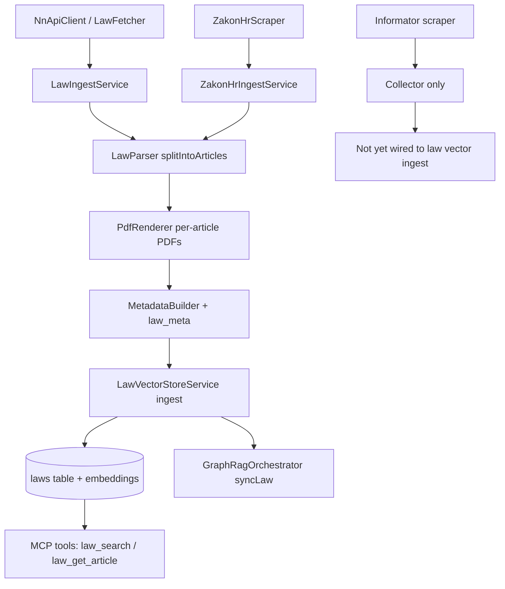

# 03 - Law Ingestion, Article PDFs, Metadata, MCP Exposure

## 0. Mermaid Flow Diagram

## 1. Law Sources in Code

### Narodne Novine (NN)

- Client: `app/Services/NnApiClient.php`
- Collector/orchestrator: `app/Services/LawFetcher.php`
- Main ingest service: `app/Services/LawIngestService.php`

### Zakon.hr

- Scraper: `app/Services/ZakonHrScraper.php`
- Ingest service: `app/Services/ZakonHrIngestService.php`
- UI ingestion entry: `app/Http/Livewire/IngestedLawsManager.php`
- CLI entry: `app/Console/Commands/ImportZakonHr.php`

### Informator

- Scraper exists: `app/Services/Informator/InformatorClient.php`, `app/Console/Commands/InformatorScrapeCommand.php`
- Not currently wired into the `LawIngestService` / `ZakonHrIngestService` ingestion to `laws`/`ingested_laws`.

## 2. Article-level decomposition

- Splitter: `LawParser::splitIntoArticles()`: `app/Services/LawParser.php`
- Used in both main ingest paths (`LawIngestService` and `ZakonHrIngestService`).

## 3. PDF regeneration per article

- `PdfRenderer::renderArticle()` renders per-article PDFs: `app/Services/PdfRenderer.php`
- Full PDF merge (Zakon.hr path): `app/Services/PdfMerger.php`
- Upload records: `LawUpload` rows associated with `IngestedLaw`: `app/Models/LawUpload.php`

## 4. Metadata injection (where fields are set)

### Parent law (`ingested_laws`)

Set in:

- `app/Services/LawIngestService.php`
- `app/Services/ZakonHrIngestService.php`

Typical fields include:

- `doc_id`, `title`, `law_number` (NN path), `source_url`, `jurisdiction`, `country`, `language`
- aliases and keyword metadata

### Per-article law chunks (`laws`)

Set via:

- `MetadataBuilder::buildArticleMetadata()`: `app/Services/MetadataBuilder.php`
- Ingest write path: `LawVectorStoreService::ingest()` + `insertDocumentsInTransaction()`: `app/Services/LawVectorStoreService.php`

Stored metadata includes article-level details such as:

- `article_number`
- heading/structure context
- law title/law number/jurisdiction
- publication/effective fields where available

This is the location to enforce the requested searchable metadata keyset (law alias, article number, pinpoint locators).

## 5. Embeddings and graph sync

- Vector ingestion target: `laws` table via `LawVectorStoreService`: `app/Services/LawVectorStoreService.php`
- Graph sync call path: `LawVectorStoreService::syncToGraphDatabase()` -> `GraphRagOrchestrator::syncLaw()`
- Additional model-hook sync behavior on `Law` updates/deletes: `app/Models/Law.php`

## 6. MCP availability for laws

### MCP protocol tools

- Registered in `routes/mcp.php`:
  - `law_search`
  - `law_get_article`

### HTTP MCP endpoints

- `POST /api/mcp/law.search`
- `POST /api/mcp/law.get_article`

Defined in `routes/api.php`, handled by `McpToolsController` and `OdlukeTools`:

- `app/Http/Controllers/McpToolsController.php`
- `app/Mcp/OdlukeTools.php`

## 7. Source-of-truth conclusion

Law ingestion is implemented end-to-end for NN and Zakon.hr, with article-level splitting, per-article PDF generation, metadata storage, vector indexing, and MCP querying.
