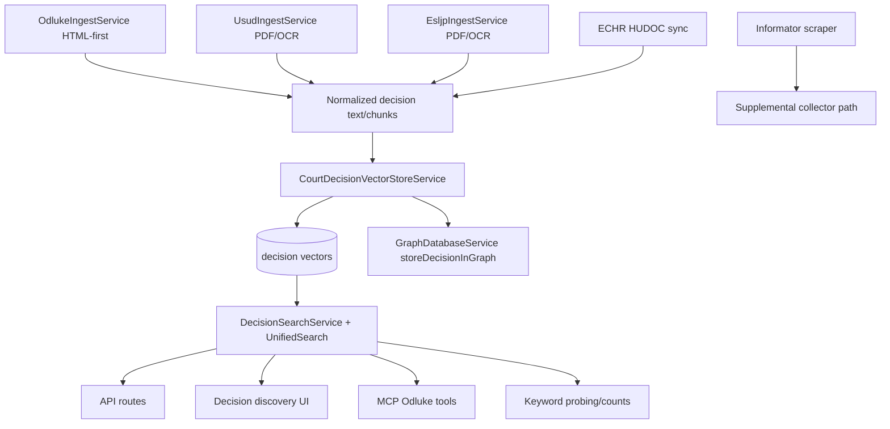

# 04 - Court Practice Ingestion and Querying

## 0. Mermaid Flow Diagram

## 1. Odluke.sudovi.hr (core domestic court decisions)

### Discovery/search/preview/ingest surfaces

- Discovery UI: `app/Http/Livewire/DecisionDiscoveryDashboard.php`
- API routes: `routes/api.php` (`/api/decisions/...`)
- MCP tools and wrappers:
  - `routes/mcp.php`
  - `app/Mcp/OdlukeTools.php`
  - `app/Tools/OdlukeSearchTool.php`
  - `app/Tools/OdlukeMetaTool.php`
  - `app/Tools/OdlukeDownloadTool.php`

### Ingestion

- Client: `app/Services/Odluke/OdlukeClient.php`
- Ingest service: `app/Services/Odluke/OdlukeIngestService.php`
- Queue job: `app/Jobs/IngestOdlukeDecision.php`
- CLI ingest variants:
  - `app/Console/Commands/IngestCourtDecisionsEmbeddings.php`
  - `app/Console/Commands/IngestOdlukeByQuery.php`

### OCR policy for odluke docs

- If HTML/text available, ingestion is digital-text-first (OCR often bypassed).
- OCR fallback exists where needed.

## 2. ECHR / ESLJP / USUD / Informator sources

### ECHR (HUDOC)

- HUDOC client: `app/Services/Hudoc/HudocClient.php`
- Sync command: `app/Console/Commands/EchrSyncCases.php`
- Case sync job: `app/Jobs/SyncEchrCaseJob.php`
- Graph relation sync: `app/Services/Hudoc/EchrGraphService.php`
- Optional Python extractor bridge:
  - `app/Services/Hudoc/EchrExtractorBridge.php`
  - `scripts/echr_extractor.py`

### ESLJP (ESLJP/usud linked source)

- Client: `app/Services/Esljp/EsljpClient.php`
- Ingest: `app/Services/Esljp/EsljpIngestService.php`
- CLI: `app/Console/Commands/IngestEsljpByQuery.php`

### Constitutional court (USUD)

- Client: `app/Services/Usud/UsudClient.php`
- Ingest: `app/Services/Usud/UsudIngestService.php`

### Informator

- Fetching/scraping exists: `app/Services/Informator/InformatorClient.php`
- Command: `app/Console/Commands/InformatorScrapeCommand.php`

## 3. Decision embedding + graph sync

- Decision vector ingestion: `app/Services/CourtDecisionVectorStoreService.php`
- Graph persistence path includes `GraphDatabaseService::storeDecisionInGraph()`: `app/Services/GraphDatabaseService.php`
- Ingest services (`OdlukeIngestService`, `UsudIngestService`, `EsljpIngestService`) can sync graph based on options/config.

## 4. Querying and search

### Unified/API search

- `POST /api/search/decisions`
- `POST /api/unified-search`

Files:

- `routes/api.php`
- `app/Http/Controllers/SearchController.php`
- `app/Http/Controllers/Api/UnifiedSearchController.php`
- `app/Services/DecisionSearchService.php`

### Court-order keyword probing and counts

- Service: `app/Services/SudskaPraksaService.php`
- CLI command: `app/Console/Commands/SudskaPraksaSearch.php`
- Docs: `docs/sudska-praksa/README.md`

## 5. Source-of-truth conclusion

Court practice ingestion is multi-source and high-volume capable. Odluke remains the primary structured flow; ECHR/ESLJP/USUD/Informator are additional streams with differing extraction quality and OCR needs.
