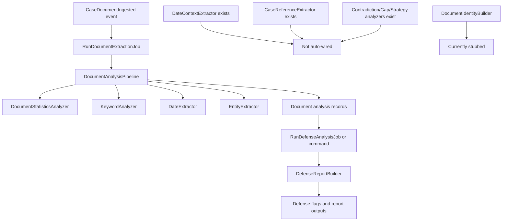

# 05 - Document Analysis and Defense Pipeline

## 0. Mermaid Flow Diagram

## 1. Trigger chain (current)

- `CaseDocumentIngested` event listener dispatches extraction job:
  - Listener: `app/Listeners/TriggerDocumentAnalysis.php`
  - Job: `app/Jobs/Analysis/RunDocumentExtractionJob.php`

## 2. What `DocumentAnalysisPipeline` currently runs

Pipeline class: `app/Services/Analysis/DocumentAnalysisPipeline.php`

Configured Layer-1 analyzers:

1. `DocumentStatisticsAnalyzer`
2. `KeywordAnalyzer`
3. `DateExtractor`
4. `EntityExtractor`

These write analysis records (`DocumentAnalysis` / related tables) for each document.

## 3. Requested identifiers (dates, KLASA, URBROJ, case IDs)

### Dates

- Implemented:
  - `DateExtractor`: `app/Services/Analysis/Analyzers/DateExtractor.php`
  - `DateContextExtractor` exists: `app/Services/Analysis/Analyzers/DateContextExtractor.php`

### KLASA/URBROJ/case identifiers

- Extractor exists:
  - `CaseReferenceExtractor`: `app/Services/Analysis/Analyzers/CaseReferenceExtractor.php`
- Registry/completeness helper exists:
  - `CaseFileRegistry`: `app/Services/Analysis/CaseLevel/CaseFileRegistry.php`
- Identity model/parser exists:
  - `DocumentIdentity`: `app/Models/DocumentIdentity.php`

## 4. Case-level analysis modules (existence vs wiring)

### Modules present

- Contradiction detection: `app/Services/Analysis/CaseLevel/AI/ContradictionDetector.php`
- Gap analysis: `app/Services/Analysis/CaseLevel/AI/GapAnalyzer.php`
- Strategy analysis: `app/Services/Analysis/CaseLevel/AI/StrategyAnalyzer.php`
- Additional: `DateClusterAnalyzer`, `CrossReferenceAnalyzer`, `MetacaseDetector`

### Wiring reality

- These case-level modules are not currently auto-dispatched from the main event/job path.
- `RunDocumentExtractionJob` handles document extraction only.

## 5. Defense aid modules

### Orchestration

- `DefenseReportBuilder` composes detector outputs: `app/Services/Defense/DefenseReportBuilder.php`
- Entrypoints:
  - `RunDefenseAnalysisJob`: `app/Jobs/Analysis/RunDefenseAnalysisJob.php`
  - `RunDefenseAnalysisCommand`: `app/Console/Commands/RunDefenseAnalysisCommand.php`

### Detector examples

- `DefenseTimeAdequacyChecker`
- `ChainOfCustodyAnalyzer`
- `ZastaraCalculator`
- `ProsecutorialDisclosureChecker`

These rely on upstream analysis types like dates/context/entities/case references.

## 6. Completeness assessment status

- `DocumentIdentityBuilder` currently behaves as a stub and returns empty/default structure:
  - `app/Services/Analysis/CaseLevel/DocumentIdentityBuilder.php`
- `CaseFileCompletenessCommand` therefore cannot yet provide a mature completeness matrix:
  - `app/Console/Commands/CaseFileCompletenessCommand.php`

## 7. Source-of-truth conclusion

The platform has major building blocks for defense-oriented analysis, including date/entity extraction, contradiction/gap/strategy modules, and defense detectors. However, automatic end-to-end orchestration from ingest to full case-level defense intelligence is only partially wired.
