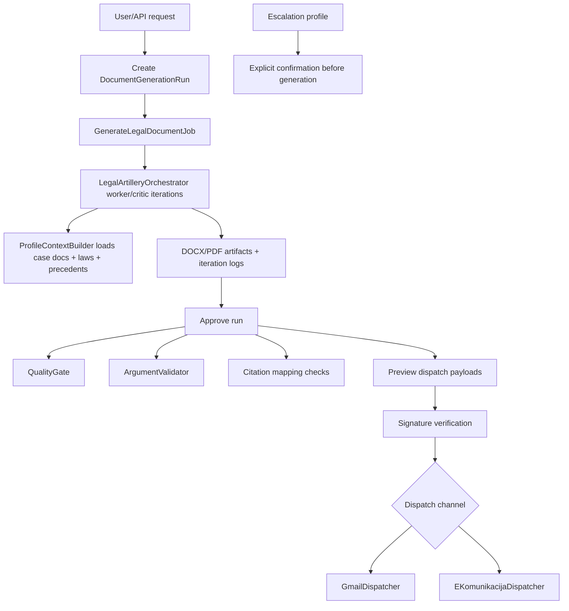

# 06 - Legal Artillery Lifecycle (Generate -> Approve -> Dispatch)

## 0. Mermaid Flow Diagram

## 1. Entry points

### Web/Livewire

- Dashboard: `app/Livewire/LegalArtillery/Dashboard.php`
- New generation UI: `app/Livewire/LegalArtillery/NewGeneration.php`
- Run details/dispatch UI: `app/Livewire/LegalArtillery/RunDetails.php`
- Web routes: `routes/web.php` (`/legal-artillery/...`)

### API

- Generation lifecycle routes in `routes/api.php` under `/api/documents`:
  - `generate`
  - `runs`
  - `runs/{id}`
  - `runs/{id}/approve`
  - `runs/{id}/preview-dispatch`
  - `runs/{id}/dispatch`
  - `runs/{id}/audit`

Controller: `app/Http/Controllers/Api/DocumentGenerationController.php`

## 2. Generation internals

- Main run model: `DocumentGenerationRun`: `app/Models/DocumentGenerationRun.php`
- Job: `GenerateLegalDocumentJob`: `app/Jobs/GenerateLegalDocumentJob.php`
- Orchestrator loop: `LegalArtilleryOrchestrator`: `app/Agents/LegalArtilleryOrchestrator.php`
- Iterations/context persistence:
  - `DocumentIteration`
  - `DocumentContext`

## 3. Profile and mode options

Config-driven in `config/legal-artillery.php`:

- Profile templates (recipient/argument posture).
- Escalation profiles and legal basis.
- Document type map and generation settings.
- Context defaults and expected fields.

Document inventory and required attachments:

- `config/legal-artillery-documents.php`
- `app/Services/LegalArtillery/DocumentInventory.php`

## 4. Case docs + laws + court practice context

Context builders access legal sources and case context via:

- `ProfileContextBuilder`: `app/Services/LegalArtillery/ProfileContextBuilder.php`
- Domain models: `LegalProvision`, `LegalPrecedent`, case/evidence models

This is where generated drafts are enriched by:

- Case material
- Relevant legal provisions
- Known precedent/court-practice context

## 5. Quality gates and approval

Approval pipeline includes:

- `QualityGate`: structure/completeness/required evidence/citations checks
- `ArgumentValidator`
- Citation mapping + coverage checks in `ResponseHandler`

Files:

- `app/Services/LegalArtillery/QualityGate.php`
- `app/Services/LegalArtillery/ArgumentValidator.php`
- `app/Services/LegalArtillery/ResponseHandler.php`
- `app/Agents/LegalArtilleryAgent.php`

## 6. Dispatch model (including escalation and auto-send behavior)

### Enforced lifecycle

1. Generate run
2. Approve run
3. Preview dispatch payload(s)
4. Apply signature requirement
5. Dispatch

### Dispatch channels

- Gmail dispatcher: `app/Services/LegalArtillery/GmailDispatcher.php`
- E-komunikacija dispatcher: `app/Services/LegalArtillery/EKomunikacijaDispatcher.php`

### Escalation

- Escalation profiles require explicit confirmation in generation flow.
- Ladder helper services exist, but not all are clearly wired into one canonical runtime path.

### Auto-send nuance

- API generation can store pending dispatch intent (`send_email` path).
- Livewire generation path currently does not persist equivalent pending dispatch options consistently.

## 7. Source-of-truth conclusion

Legal Artillery is production-shaped and feature-rich, with strong lifecycle controls (approval/preview/signature/dispatch). Main risks are around duplicated service wiring and inconsistent auto-send option persistence between API and Livewire path.
