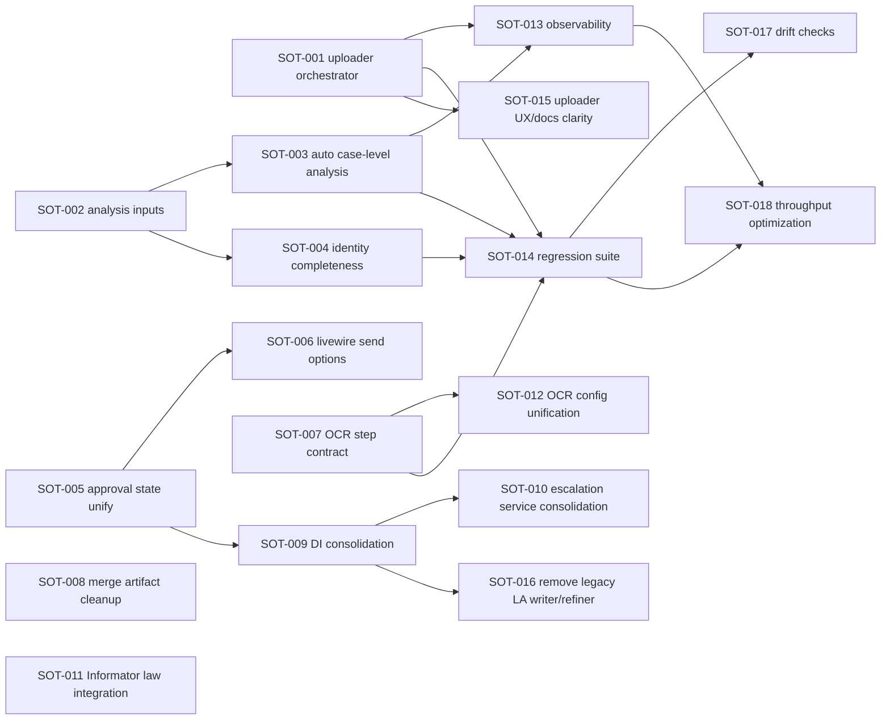

# 09 - Sprint Execution Plan (Story Points + Dependency Graph)

Plan created: **February 8, 2026**  
Source backlog: `documentation/source-of-truth/08-implementation-backlog-p0-p2.md`

## Planning Baseline

This plan assumes a cross-functional team capacity of **20-24 SP per sprint** (2-week sprint).
If your real capacity differs, keep dependencies and critical path intact and re-bucket by point totals.

## Story Catalog (Sprint-ready)

| Story ID | Backlog ID | Story | SP | Depends On | Primary Files |
|---|---|---|---|---|---|
| SOT-001 | P0-01 | Wire `/uploader` completion to canonical ingest orchestrator | 8 | - | `app/Http/Controllers/UploadController.php`, `app/Services/UploadService.php` |
| SOT-002 | P0-02 | Add `DateContextExtractor` + `CaseReferenceExtractor` to analysis pipeline | 3 | - | `app/Services/Analysis/DocumentAnalysisPipeline.php` |
| SOT-003 | P0-03 | Auto-run case-level contradiction/gap/strategy analysis post extraction | 5 | SOT-002 | `app/Jobs/Analysis/RunDocumentExtractionJob.php`, `app/Listeners/TriggerDocumentAnalysis.php` |
| SOT-004 | P0-04 | Implement `DocumentIdentityBuilder` completeness matrix | 5 | SOT-002 | `app/Services/Analysis/CaseLevel/DocumentIdentityBuilder.php` |
| SOT-005 | P0-05 | Unify Legal Artillery approval source of truth | 5 | - | `app/Models/DocumentGenerationRun.php`, `app/Agents/LegalArtilleryAgent.php` |
| SOT-006 | P0-06 | Persist and operationalize Livewire send options | 3 | SOT-005 | `app/Livewire/LegalArtillery/NewGeneration.php`, `app/Jobs/GenerateLegalDocumentJob.php` |
| SOT-007 | P0-07 | Fix OCR step contract (`ocrDocument` guarantee/resilience) | 3 | - | `app/Pipelines/Textract/CollectLinesStep.php`, `app/Pipelines/Textract/CreateMetadataStep.php` |
| SOT-008 | P0-08 | Remove route merge artifact + add CI conflict-marker check | 1 | - | `routes/api.php`, CI config |
| SOT-009 | P1-01 | Consolidate Legal Artillery DI bindings to one canonical provider path | 3 | SOT-005 | `app/Providers/AppServiceProvider.php`, `app/Providers/LegalArtilleryServiceProvider.php` |
| SOT-010 | P1-02 | Consolidate escalation suggesters to one canonical service | 3 | SOT-009 | escalation services |
| SOT-011 | P1-03 | Integrate Informator into law ingest/vector pipeline | 8 | - | Informator + law ingest services |
| SOT-012 | P1-04 | Unify OCR config namespace consumption | 2 | SOT-007 | `config/ocr.php`, OCR steps/services |
| SOT-013 | P1-05 | Add end-to-end ingest observability (correlation ID + stage metrics) | 5 | SOT-001, SOT-003 | ingest jobs/services/logging |
| SOT-014 | P1-06 | Add regression tests for `/uploader` and Drive full chain | 8 | SOT-001, SOT-003, SOT-004, SOT-007 | tests + related pipelines |
| SOT-015 | P2-01 | Clarify `/uploader` behavior in UI/docs | 2 | SOT-001 | uploader view/docs |
| SOT-016 | P2-02 | Remove/archive unused Legal Artillery legacy writer/refiner | 3 | SOT-009 | legacy Legal Artillery services |
| SOT-017 | P2-03 | Add architecture drift checks for route/job topology vs docs | 5 | SOT-014 | CI + docs tooling |
| SOT-018 | P2-04 | Throughput optimization for high-volume ingestion queues | 8 | SOT-013, SOT-014 | queue config + ingest jobs |

Total catalog size: **80 SP**

## Dependency Graph (Mermaid)

## Critical Path

Primary critical path for reliable end-to-end ingestion and defense outputs:

1. `SOT-001` -> `SOT-013` -> `SOT-014` -> `SOT-018`
2. `SOT-002` -> `SOT-003` -> `SOT-014`
3. `SOT-002` -> `SOT-004` -> `SOT-014`

Primary critical path for Legal Artillery lifecycle correctness:

1. `SOT-005` -> `SOT-006`
2. `SOT-005` -> `SOT-009` -> `SOT-010`

## Sprint Buckets

## Sprint 1 (Target: 22 SP)

Goal: establish ingestion continuity and baseline pipeline safety.

| Story ID | SP |
|---|---|
| SOT-001 | 8 |
| SOT-002 | 3 |
| SOT-007 | 3 |
| SOT-008 | 1 |
| SOT-012 | 2 |
| SOT-015 | 2 |
| SOT-005 (start with core state normalization slice) | 3 |

Total: **22 SP**

## Sprint 2 (Target: 21 SP)

Goal: complete analysis chain and Legal Artillery lifecycle consistency.

| Story ID | SP |
|---|---|
| SOT-003 | 5 |
| SOT-004 | 5 |
| SOT-006 | 3 |
| SOT-009 | 3 |
| SOT-010 | 3 |
| SOT-016 | 2 (first slice, archive plan + removals) |

Total: **21 SP**

## Sprint 3 (Target: 21 SP)

Goal: platform hardening and regression confidence.

| Story ID | SP |
|---|---|
| SOT-013 | 5 |
| SOT-014 | 8 |
| SOT-011 | 8 |

Total: **21 SP**

## Sprint 4 (Target: 16 SP)

Goal: quality automation and scale/performance readiness.

| Story ID | SP |
|---|---|
| SOT-017 | 5 |
| SOT-018 | 8 |
| SOT-016 (remaining cleanup) | 3 |

Total: **16 SP**

## Execution Notes

1. Do not start `SOT-014` until `SOT-001`, `SOT-003`, `SOT-004`, and `SOT-007` are merged, or test churn will be high.
2. Keep `SOT-005` in Sprint 1 to avoid rework across `SOT-006`, `SOT-009`, and `SOT-010`.
3. Track one release gate per sprint:
   - Sprint 1 gate: `/uploader` can trigger canonical ingest run.
   - Sprint 2 gate: defense-required analysis artifacts are automatically generated.
   - Sprint 3 gate: regression suite proves both ingest entry paths.
   - Sprint 4 gate: throughput and drift checks are active in CI/monitoring.

## Sprint Definition of Done

1. Stories merged behind feature flags where production rollout risk exists.
2. Integration tests added/updated for each changed flow.
3. Runbook/documentation in `documentation/source-of-truth/` updated in same PR.
4. Metrics/logging dashboards updated where observability-sensitive stories are implemented.

